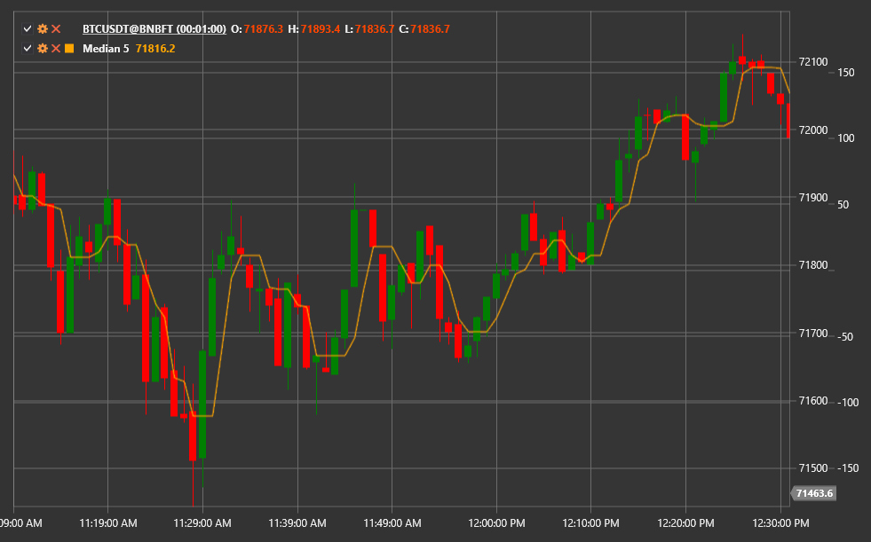

# Moving Median

The **Moving Median** indicator calculates the median of the most recent N values. Compared with moving averages it is less
sensitive to outliers and preserves abrupt price changes, which makes it useful in noisy environments.

Use the [Median](xref:StockSharp.Algo.Indicators.Median) class to access the indicator.

## Description

A median filter sorts the prices inside the moving window and selects the middle value. As a result:

- Single spikes or drops do not distort the output.
- The lag is smaller than with many smoothing filters.
- The shape of the signal remains more angular, helping to capture reversals.

## Parameters

- **Length** — window size used to compute the median. Larger windows deliver stronger smoothing but increase lag.

## Usage

- Apply the Moving Median as an alternative to moving averages when price data contains significant noise.
- Crossovers between price and the median can be treated as trend-change signals.
- Combine the median with other filters to extract trends while keeping important price jumps.

## See also

[SMA](sma.md)
[EMA](ema.md)
[Smoothed Moving Average](smoothed_ma.md)
