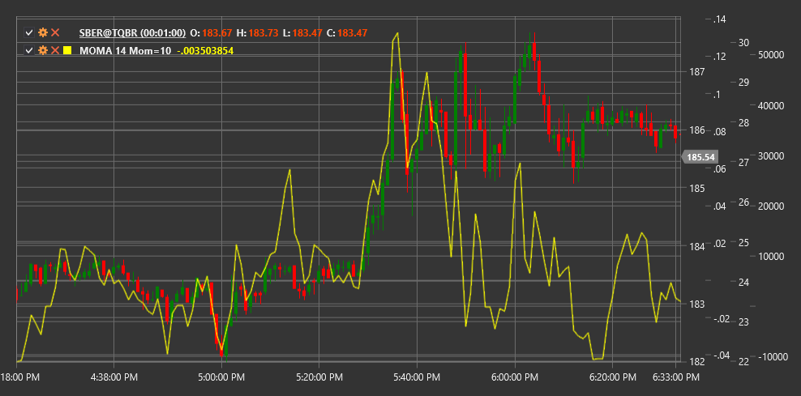

# MOMA

**Momentum of Moving Average (MOMA)** is a technical indicator that measures the rate of change of the moving average price, combining the concepts of momentum and moving averages.

To use the indicator, you need to use the [MomentumOfMovingAverage](xref:StockSharp.Algo.Indicators.MomentumOfMovingAverage) class.

## Description

Momentum of Moving Average (MOMA) is a combination of two indicators - a momentum indicator and a moving average. First, a moving average of the price series is calculated, and then the momentum (rate of change) of this moving average is measured.

The main idea of MOMA is to first smooth the price series using a moving average, thereby removing market noise, and then analyze the speed and direction of change in this smoothed curve. This allows obtaining a cleaner signal about trend momentum change than calculating momentum directly from the price.

MOMA helps determine trend strength and potential reversal points by focusing on changes in moving average dynamics, rather than the price itself. Positive MOMA values indicate an upward moving average momentum, while negative values indicate a downward momentum.

## Parameters

The indicator has the following parameters:
- **Length** - period for moving average calculation (default value: 14)
- **MomentumPeriod** - period for momentum calculation (default value: 10)

## Calculation

Momentum of Moving Average calculation involves the following steps:

1. Calculate moving average for the price series:
   ```
   MA = SMA(Price, Length)
   ```

2. Calculate moving average momentum:
   ```
   MOMA = MA[current] - MA[current - MomentumPeriod]
   ```

Where:
- Price - price (usually closing price)
- SMA - simple moving average
- Length - period for moving average
- MomentumPeriod - period for momentum calculation

Note: Other types of moving averages such as EMA (exponential moving average), WMA (weighted moving average), etc., can also be used instead of SMA.

## Interpretation

Momentum of Moving Average can be interpreted as follows:

1. **Zero Line Crossovers**:
   - MOMA crossing the zero line from bottom to top can be viewed as a bullish signal, indicating the start or strengthening of an upward trend
   - MOMA crossing the zero line from top to bottom can be viewed as a bearish signal, indicating the start or strengthening of a downward trend

2. **Absolute Values**:
   - High positive MOMA values indicate strong upward moving average momentum
   - High negative MOMA values indicate strong downward moving average momentum
   - Values close to zero indicate no pronounced momentum or a sideways trend

3. **Divergences**:
   - Bullish Divergence: price forms a new low, while MOMA forms a higher low
   - Bearish Divergence: price forms a new high, while MOMA forms a lower high

4. **Direction Change**:
   - When MOMA changes direction of movement (from rising to falling or vice versa), this may signal a potential change in the moving average trend
   - Such reversals often precede changes in price direction

5. **Trend Confirmation**:
   - Positive MOMA values confirm an upward trend
   - Negative MOMA values confirm a downward trend
   - Increasing MOMA values indicate strengthening of the current trend
   - Decreasing MOMA values indicate weakening of the current trend

6. **Signal Filtering**:
   - MOMA can be used to filter signals from other indicators
   - For example, consider only bullish signals when MOMA is positive, and only bearish signals when MOMA is negative

7. **Parameter Selection**:
   - Shorter periods for Length and MomentumPeriod make MOMA more sensitive, but also more prone to false signals
   - Longer periods make MOMA smoother but may lead to lagging signals



## See Also

[Momentum](momentum.md)
[SMA](sma.md)
[EMA](ema.md)
[ROC](roc.md)