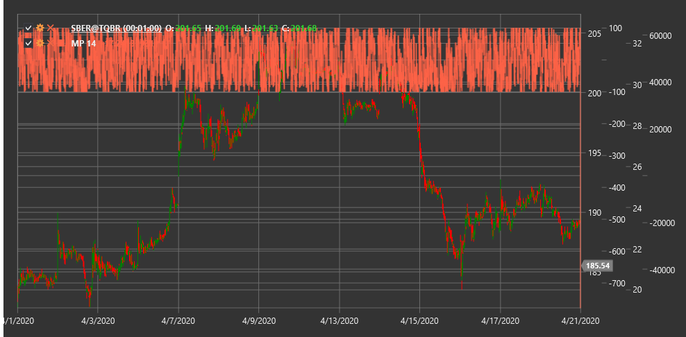

# MP

**Momentum Pinball (MP)** is a technical indicator that analyzes price momentum and its changes to identify potential reversal points and trend strength in the market.

To use the indicator, you need to use the [MomentumPinball](xref:StockSharp.Algo.Indicators.MomentumPinball) class.

## Description

The Momentum Pinball (MP) indicator is a specialized oscillator designed to track price momentum and identify potential reversal points. The name "pinball" reflects the indicator's ability to identify moments when price, like a ball in a pinball machine, bounces off extreme positions.

MP analyzes the relationship between current momentum and its historical extremes, determining when the market reaches overbought or oversold conditions. The indicator also helps identify moments when momentum begins to weaken, which may precede a trend reversal.

The main idea is that extreme momentum values are often unstable, and after reaching such extremes, a correction or reversal usually follows. MP helps visualize this process by tracking both momentum itself and its changes.

## Parameters

The indicator has the following parameters:
- **Length** - calculation period (default value: 14)

## Calculation

Momentum Pinball Indicator calculation involves the following steps:

1. Calculate base momentum as the difference between current price and price N periods ago:
   ```
   Momentum = Price[current] - Price[current - Length]
   ```

2. Determine historical maximum and minimum momentum over the specified period:
   ```
   Max_Momentum = Maximum(Momentum) over Length period
   Min_Momentum = Minimum(Momentum) over Length period
   ```

3. Normalize current momentum relative to historical extremes:
   ```
   Normalized_Momentum = (Momentum - Min_Momentum) / (Max_Momentum - Min_Momentum)
   ```

4. Calculate rate of change for normalized momentum:
   ```
   Momentum_Change = Normalized_Momentum[current] - Normalized_Momentum[current - 1]
   ```

5. Final MP calculation as a combination of normalized momentum and its change:
   ```
   MP = Normalized_Momentum + Momentum_Change
   ```

Where:
- Price - price (usually closing price)
- Length - calculation period
- Momentum - base momentum
- Normalized_Momentum - normalized momentum
- Momentum_Change - momentum change

## Interpretation

The Momentum Pinball indicator can be interpreted as follows:

1. **Extreme Levels**:
   - Values above 0.8 indicate market overbought conditions
   - Values below 0.2 indicate market oversold conditions
   - When MP reaches these levels, the probability of a reversal or correction increases

2. **Divergences**:
   - Bullish Divergence: price forms a new low, while MP forms a higher low
   - Bearish Divergence: price forms a new high, while MP forms a lower high
   - Divergences often precede significant trend reversals

3. **Centerline Crossovers**:
   - MP crossing the 0.5 level from bottom to top can be viewed as a bullish signal
   - MP crossing the 0.5 level from top to bottom can be viewed as a bearish signal

4. **Rebounds from Extremes**:
   - MP reversal from overbought or oversold levels can generate market entry signals
   - Particularly strong signals form when such reversals are accompanied by divergences

5. **Trend Analysis**:
   - Sustained MP values above 0.5 confirm an upward trend
   - Sustained MP values below 0.5 confirm a downward trend
   - MP oscillations around the 0.5 level indicate a sideways trend or uncertainty

6. **Momentum Strength**:
   - Steep MP slope indicates strong momentum
   - Shallow MP slope indicates weak momentum
   - Slowdown in MP rise or fall may precede a trend reversal

7. **Combining with Other Indicators**:
   - MP is often used in combination with trend indicators
   - For example, moving averages can be used to determine trend direction, while MP can be used for entry and exit points



## See Also

[Momentum](momentum.md)
[RSI](rsi.md)
[StochasticOscillator](stochastic_oscillator.md)
[PrettyGoodOscillator](pretty_good_oscillator.md)