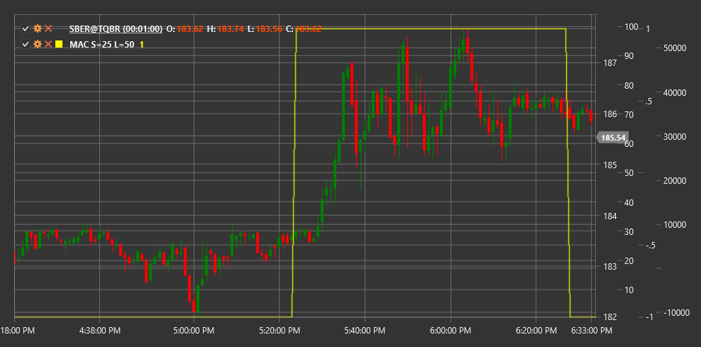

# MAC

**Moving Average Crossover (MAC)** is a technical indicator that tracks crossovers between short and long moving averages to identify potential market entry and exit points.

To use the indicator, you need to use the [MovingAverageCrossover](xref:StockSharp.Algo.Indicators.MovingAverageCrossover) class.

## Description

The Moving Average Crossover (MAC) indicator is one of the most widely used and easy-to-understand indicators in technical analysis. It is based on the concept that when a short-term moving average crosses a long-term moving average, it may signal a trend change or significant price movement.

MAC uses two moving averages with different periods:
1. Short Moving Average (FastMA) - reflects recent price movement
2. Long Moving Average (SlowMA) - reflects longer-term price movement

The indicator is typically represented as the difference between the short and long moving averages, which allows for easy identification of the crossover moment (when the indicator value crosses the zero line).

MAC is widely used both in standalone trading strategies and as part of more complex systems, such as MACD (Moving Average Convergence Divergence).

## Parameters

The indicator has the following parameters:
- **ShortPeriod** - period for the short moving average (default value: 9)
- **LongPeriod** - period for the long moving average (default value: 26)

## Calculation

Moving Average Crossover indicator calculation involves the following steps:

1. Calculate the short moving average:
   ```
   FastMA = SMA(Price, ShortPeriod)
   ```

2. Calculate the long moving average:
   ```
   SlowMA = SMA(Price, LongPeriod)
   ```

3. Calculate MAC value as the difference between short and long moving averages:
   ```
   MAC = FastMA - SlowMA
   ```

Where:
- Price - price (usually closing price)
- SMA - simple moving average
- ShortPeriod - period for the short moving average
- LongPeriod - period for the long moving average

Note: Other types of moving averages such as EMA (exponential moving average), WMA (weighted moving average), etc., can also be used instead of SMA.

## Interpretation

The Moving Average Crossover indicator can be interpreted as follows:

1. **Zero Line Crossovers**:
   - Crossing MAC zero line from bottom to top (FastMA crosses SlowMA from bottom to top) generates a bullish signal, indicating a potential upward trend start
   - Crossing MAC zero line from top to bottom (FastMA crosses SlowMA from top to bottom) generates a bearish signal, indicating a potential downward trend start

2. **Indicator Value**:
   - Positive MAC value indicates that the short moving average is above the long moving average, often interpreted as a bullish market state
   - Negative MAC value indicates that the short moving average is below the long moving average, often interpreted as a bearish market state

3. **Distance Between Moving Averages**:
   - Increasing distance between moving averages (increasing MAC absolute value) indicates trend strengthening
   - Decreasing distance between moving averages (decreasing MAC absolute value) may indicate trend weakening and potential reversal

4. **False Signals**:
   - During sideways consolidation periods, MAC may generate multiple false signals due to frequent moving average crossovers
   - Additional indicators or rules are often used to filter false signals (e.g., requiring price to be above/below both moving averages)

5. **Combining with Other Indicators**:
   - MAC is often used in combination with momentum indicators (RSI, Stochastic) to confirm signals
   - It can also be combined with trend and volatility indicators to create more comprehensive trading systems

6. **Parameter Selection**:
   - Shorter periods (e.g., 5 and 20) are more sensitive and suitable for short-term trading
   - Longer periods (e.g., 50 and 200) are less sensitive and suitable for long-term trading



## See Also

[SMA](sma.md)
[EMA](ema.md)
[MACD](macd.md)
[MovingAverageRibbon](moving_average_ribbon.md)