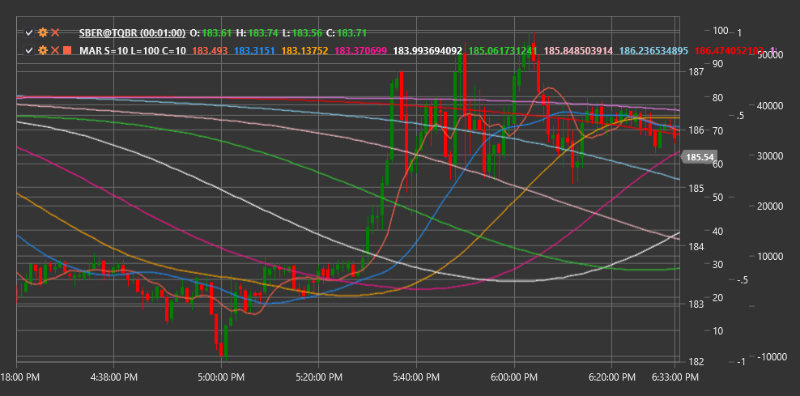

# MAR

**Moving Average Ribbon (MAR)** is a technical indicator that displays multiple moving averages with progressively increasing periods to visualize trend strength and direction.

To use the indicator, you need to use the [MovingAverageRibbon](xref:StockSharp.Algo.Indicators.MovingAverageRibbon) class.

## Description

The Moving Average Ribbon (MAR) is a set of multiple moving averages displayed on a chart in a "ribbon" or "fan" formation. This indicator helps traders visualize the current trend state and its strength more intuitively than using one or two moving averages.

MAR includes several moving averages (typically 5 to 10) with progressively increasing periods. The interval between periods can be uniform (e.g., 10, 20, 30, 40...) or exponential (e.g., 5, 10, 20, 40...).

The main idea is that the mutual positioning and shape of these moving averages can provide valuable information about the current trend's state and strength, and help identify potential reversal points.

## Parameters

The indicator has the following parameters:
- **ShortPeriod** - initial (minimum) period for moving averages (default value: 10)
- **LongPeriod** - final (maximum) period for moving averages (default value: 100)
- **RibbonCount** - number of moving averages in the ribbon (default value: 10)

## Calculation

Moving Average Ribbon calculation involves the following steps:

1. Determine the sequence of periods for moving averages:
   ```
   Step = (LongPeriod - ShortPeriod) / (RibbonCount - 1)
   Periods = [ShortPeriod, ShortPeriod + Step, ShortPeriod + 2*Step, ..., LongPeriod]
   ```

2. Calculate moving average for each period:
   ```
   MAs = [SMA(Price, Period) for each Period in Periods]
   ```

Where:
- Price - price (usually closing price)
- SMA - simple moving average
- ShortPeriod - initial period
- LongPeriod - final period
- RibbonCount - number of moving averages

Note: Other types of moving averages such as EMA (exponential moving average), WMA (weighted moving average), etc., can be used instead of SMA.

## Interpretation

The Moving Average Ribbon can be interpreted as follows:

1. **Mutual Positioning of Moving Averages**:
   - When all lines are arranged in ascending order of periods (shortest on top, longest at bottom), this indicates a strong upward trend
   - When all lines are arranged in descending order of periods (shortest at bottom, longest on top), this indicates a strong downward trend
   - When lines intersect and have no clear order, this indicates a sideways trend or uncertainty

2. **Ribbon Shape**:
   - Expanding ribbon (increasing distance between lines) indicates trend strengthening
   - Contracting ribbon (decreasing distance between lines) indicates trend weakening
   - Tight grouping of lines indicates consolidation or lack of a pronounced trend

3. **Moving Average Crossovers**:
   - Beginning of line intersections may signal a potential trend change
   - When short moving averages start crossing long ones, this can be an early signal of trend reversal

4. **Ribbon Slope Angle**:
   - Steep angle indicates a strong trend
   - Shallow angle indicates a weak trend
   - Horizontal ribbon positioning indicates a sideways trend

5. **Price Position Relative to Ribbon**:
   - When price is above the entire ribbon, this confirms a strong upward trend
   - When price is below the entire ribbon, this confirms a strong downward trend
   - When price moves within the ribbon, this may indicate a transitional state or consolidation

6. **Trading Strategies**:
   - Enter a position when price bounces from the ribbon's edge in the trend direction
   - Exit a position when moving averages begin to cross in the opposite direction
   - Use ribbon width to set stop-losses and take-profits



## See Also

[SMA](sma.md)
[EMA](ema.md)
[MovingAverageCrossover](moving_average_crossover.md)
[GuppyMultipleMovingAverage](guppy_multiple_moving_average.md)