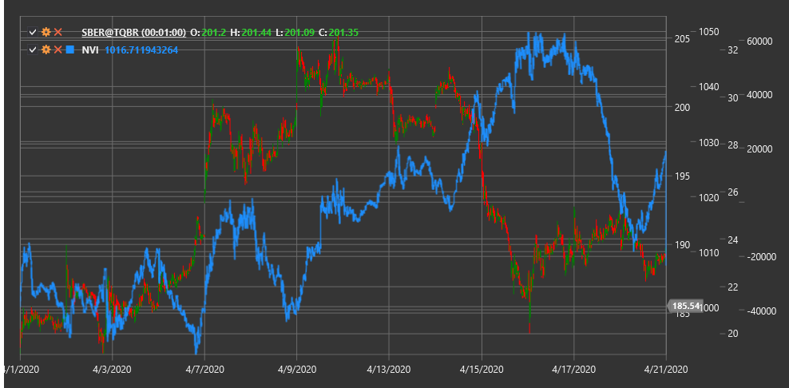

# NVI

**Negative Volume Index (NVI)** is a technical indicator developed by Paul Dysart that focuses on price changes on days when trading volume decreases compared to the previous day.

To use the indicator, you need to use the [NegativeVolumeIndex](xref:StockSharp.Algo.Indicators.NegativeVolumeIndex) class.

## Description

The Negative Volume Index (NVI) is based on the idea that "smart money" is active on low-volume days, while the "crowd" (non-professional traders) is more active on high-volume days. NVI changes only on days when the current volume is lower than the previous day's volume.

The indicator's concept suggests that price movements on reduced volume are more significant and often reflect the actions of informed investors. NVI seeks to track these movements, ignoring price changes on days with increased volume.

NVI is often used together with the complementary Positive Volume Index (PVI), which, in contrast, considers only days when volume increases.

## Calculation

Negative Volume Index calculation involves the following steps:

1. Set initial NVI value (usually 1000):
   ```
   NVI[initial] = 1000
   ```

2. For each subsequent period:
   ```
   If Volume[current] < Volume[previous], then:
       NVI[current] = NVI[previous] * (1 + (Price[current] - Price[previous]) / Price[previous])
   Otherwise:
       NVI[current] = NVI[previous]
   ```

Where:
- Price - price (usually closing price)
- Volume - trading volume

In other words, NVI changes only on days when trading volume decreases and remains unchanged on days with increasing or unchanged volume.

## Interpretation

The Negative Volume Index can be interpreted as follows:

1. **Trend Analysis**:
   - Rising NVI indicates that "smart money" is buying, which may foretell future price increase
   - Falling NVI indicates that "smart money" is selling, which may foretell future price decline

2. **Moving Average Crossovers**:
   - NVI is often compared to its 255-day moving average (approximately one year of trading)
   - When NVI is above its 255-day SMA, it is considered a bullish signal
   - When NVI is below its 255-day SMA, it is considered a bearish signal

3. **Divergences**:
   - Bullish Divergence: price forms a new low, while NVI forms a higher low
   - Bearish Divergence: price forms a new high, while NVI forms a lower high

4. **Combining with PVI**:
   - When both NVI and PVI are rising, it's a strong bullish signal
   - When both NVI and PVI are falling, it's a strong bearish signal
   - When NVI rises and PVI falls, it may indicate "smart money" buying while the "crowd" sells (potentially bullish scenario)
   - When NVI falls and PVI rises, it may indicate "smart money" selling while the "crowd" buys (potentially bearish scenario)

5. **Long-Term Changes**:
   - NVI is often viewed as a long-term indicator
   - Sustained change in NVI direction may signal a significant shift in market sentiment

6. **Confirming Other Indicators**:
   - NVI works best when combined with other technical indicators and analysis methods
   - NVI signals become more reliable when confirmed by other indicators

7. **Setting Thresholds**:
   - Some traders set threshold levels for NVI (e.g., 5% above or below the moving average)
   - Crossing these thresholds may be considered a stronger signal than simple crossovers



## See Also

[OBV](on_balance_volume.md)
[ADL](accumulation_distribution_line.md)
[ChaikinMoneyFlow](chaikin_money_flow.md)
[ForceIndex](force_index.md)