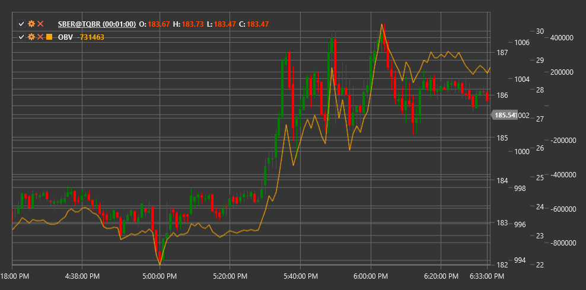

# OBV

**On-Balance Volume (OBV)** is a technical indicator developed by Joseph Granville that uses trading volume to forecast price changes by accumulating volume based on price direction.

To use the indicator, you need to use the [OnBalanceVolume](xref:StockSharp.Algo.Indicators.OnBalanceVolume) class.

## Description

On-Balance Volume (OBV) is a cumulative indicator that adds volume when the closing price rises and subtracts volume when the closing price falls. The indicator is based on the concept that volume changes precede price changes. According to this theory, when volume increases significantly without a corresponding price change, it should be expected that the price will eventually rise, and vice versa.

OBV aims to detect moments when "smart money" (large institutional investors) are accumulating or distributing positions, which may foretell future price movement. The indicator is particularly useful for identifying divergences between price and volume that may signal potential market reversals.

The OBV indicator was first introduced by Joseph Granville in 1963 in his book "Granville's New Key to Stock Market Profits" and has since become one of the most widely used volume indicators.

## Calculation

On-Balance Volume calculation is very simple:

1. Set initial OBV value (usually 0 or an arbitrary number):
   ```
   OBV[initial] = 0
   ```

2. For each subsequent period:
   ```
   If Close[current] > Close[previous], then:
       OBV[current] = OBV[previous] + Volume[current]
   If Close[current] < Close[previous], then:
       OBV[current] = OBV[previous] - Volume[current]
   If Close[current] = Close[previous], then:
       OBV[current] = OBV[previous]
   ```

Where:
- Close - closing price
- Volume - trading volume

## Interpretation

On-Balance Volume can be interpreted as follows:

1. **Trend Analysis**:
   - Rising OBV indicates volume entering the market (accumulation), which may foretell price increase
   - Falling OBV indicates volume leaving the market (distribution), which may foretell price decline
   - Flat OBV indicates no directional volume movement, which may correspond to a sideways trend

2. **Price Trend Confirmation**:
   - If OBV moves in the same direction as price, this confirms the current price trend
   - If OBV and price move in opposite directions, this may signal a potential trend reversal

3. **Divergences**:
   - Bullish Divergence: price forms a new low, while OBV forms a higher low (buy signal)
   - Bearish Divergence: price forms a new high, while OBV forms a lower high (sell signal)

4. **OBV Breakouts**:
   - OBV breakout of resistance or support level often precedes a similar breakout on the price chart
   - Traders can use OBV trendline breakouts to forecast future price movements

5. **Baseline**:
   - Some traders use OBV moving averages as "baseline" lines
   - OBV crossing its moving average can generate trading signals

6. **Technical Analysis Patterns**:
   - Classic technical analysis patterns can form on the OBV chart, such as "head and shoulders", "double bottom", etc.
   - These patterns can provide additional trading signals

7. **Volume Spikes**:
   - Sudden sharp changes in OBV may indicate significant changes in market sentiment
   - Such "volume spikes" often precede substantial price movements

It's important to note that OBV is a cumulative indicator, so its absolute value is not of great significance. The direction of OBV movement and its relationship to price movement are what matter.



## See Also

[ADL](accumulation_distribution_line.md)
[ChaikinMoneyFlow](chaikin_money_flow.md)
[ForceIndex](force_index.md)
[NegativeVolumeIndex](negative_volume_index.md)