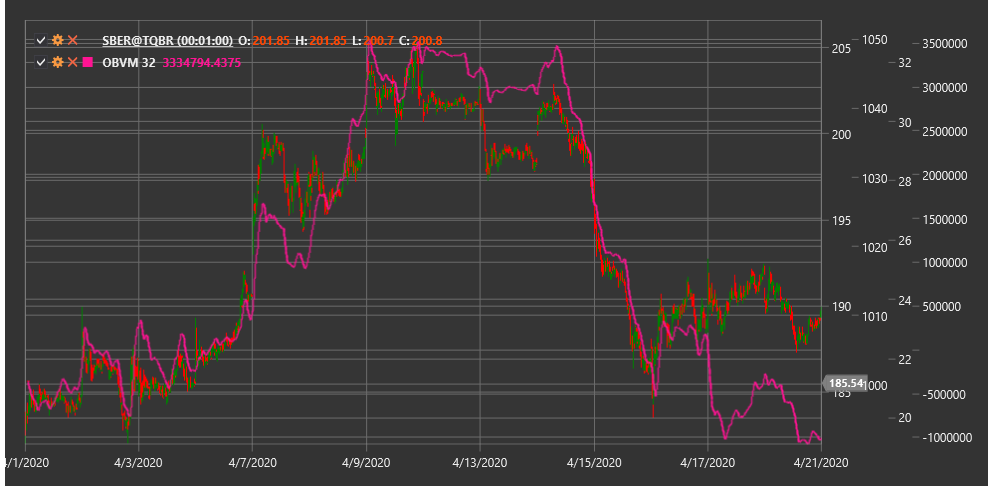

# OBVM

**On Balance Volume Mean (OBVM)** is a technical indicator that represents a moving average of the On Balance Volume (OBV) indicator, allowing for clearer trend signals based on volume.

To use the indicator, you need to use the [OnBalanceVolumeMean](xref:StockSharp.Algo.Indicators.OnBalanceVolumeMean) class.

## Description

On Balance Volume Mean (OBVM) is a modification of the classic On Balance Volume (OBV) indicator that applies a moving average to OBV values to smooth out fluctuations and identify clearer trends. The indicator maintains the core concept of OBV - volume accumulation based on price direction change, but adds an additional layer of filtering.

OBVM helps eliminate noise present in the original OBV and makes long-term volume flow trends more noticeable. This is particularly useful in volatile markets or when analyzing instruments with irregular trading volumes.

The main advantage of OBVM is its ability to generate clearer and less prone to false signals trading signals compared to the classic OBV. The indicator can also be used to identify crossovers between OBV and its mean value, providing additional trading opportunities.

## Parameters

The indicator has the following parameters:
- **Length** - period for moving average calculation (default value: 20)

## Calculation

On Balance Volume Mean calculation involves the following steps:

1. Calculate the base On Balance Volume (OBV) indicator:
   ```
   If Close[current] > Close[previous]:
       OBV[current] = OBV[previous] + Volume[current]
   If Close[current] < Close[previous]:
       OBV[current] = OBV[previous] - Volume[current]
   If Close[current] = Close[previous]:
       OBV[current] = OBV[previous]
   ```

2. Apply moving average to OBV values:
   ```
   OBVM = SMA(OBV, Length)
   ```

Where:
- Close - closing price
- Volume - trading volume
- OBV - On Balance Volume
- SMA - simple moving average
- Length - moving average period

Note: Other types of moving averages such as EMA (exponential moving average), WMA (weighted moving average), etc., can be used instead of SMA.

## Interpretation

On Balance Volume Mean can be interpreted as follows:

1. **Trend Analysis**:
   - Rising OBVM indicates a bullish trend with strong volume support
   - Falling OBVM indicates a bearish trend with strong volume support
   - Flat OBVM indicates no pronounced trend

2. **OBV and OBVM Crossovers**:
   - When OBV crosses OBVM from bottom to top, it can be viewed as a bullish signal
   - When OBV crosses OBVM from top to bottom, it can be viewed as a bearish signal
   - These crossovers often indicate the start of new trends or significant price movements

3. **Divergences**:
   - Bullish Divergence: price forms a new low, while OBVM forms a higher low
   - Bearish Divergence: price forms a new high, while OBVM forms a lower high
   - Divergences often precede significant trend reversals

4. **Price Trend Confirmation**:
   - If OBVM moves in the same direction as price, this confirms the current price trend
   - If OBVM and price move in opposite directions, this may signal a potential trend reversal

5. **Support and Resistance Levels**:
   - The OBVM chart can form its own support and resistance levels
   - Breakout of these levels may precede similar breakouts on the price chart

6. **Comparison with Other Volume Indicators**:
   - OBVM can be compared with other volume indicators to confirm signals
   - Consistency of signals from multiple volume indicators increases their reliability

7. **Length Parameter Selection**:
   - Shorter periods (e.g., 10-15) make OBVM more sensitive to short-term changes
   - Longer periods (e.g., 30-50) better identify long-term trends
   - Optimal period depends on trading time horizon and specific instrument characteristics



## See Also

[OBV](on_balance_volume.md)
[ADL](accumulation_distribution_line.md)
[ChaikinMoneyFlow](chaikin_money_flow.md)
[ForceIndex](force_index.md)