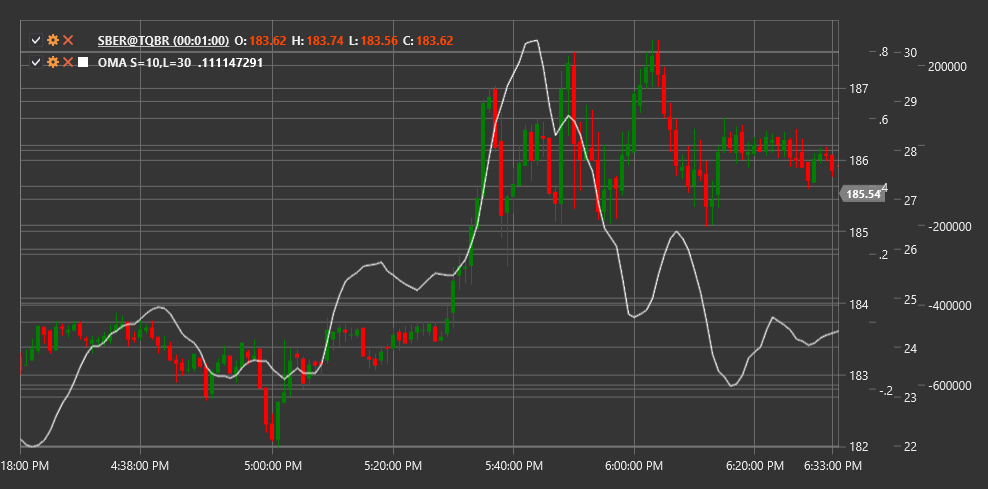

# OMA

**Oscillator of Moving Average (OMA)** is a technical indicator that measures the difference between two moving averages with different periods to determine momentum and potential reversal points.

To use the indicator, you need to use the [OscillatorOfMovingAverage](xref:StockSharp.Algo.Indicators.OscillatorOfMovingAverage) class.

## Description

The Oscillator of Moving Average (OMA) represents the difference between a short and a long moving average. This indicator helps determine trend strength and its potential changes by analyzing the relationship between moving averages of different periods.

OMA works on a principle similar to MACD (Moving Average Convergence Divergence), but in a simpler form, as it does not include a signal line. The indicator oscillates around the zero line, where positive values indicate that the short moving average is above the long moving average (bullish state), and negative values indicate that the short moving average is below the long moving average (bearish state).

The main strength of OMA lies in its ability to identify changes in trend momentum and generate trading signals based on zero line crossovers and price divergences.

## Parameters

The indicator has the following parameters:
- **ShortPeriod** - period for the short moving average (default value: 12)
- **LongPeriod** - period for the long moving average (default value: 26)

## Calculation

Oscillator of Moving Average calculation involves the following steps:

1. Calculate the short moving average:
   ```
   Short MA = SMA(Price, ShortPeriod)
   ```

2. Calculate the long moving average:
   ```
   Long MA = SMA(Price, LongPeriod)
   ```

3. Calculate OMA as the difference between short and long moving averages:
   ```
   OMA = Short MA - Long MA
   ```

Where:
- Price - price (usually closing price)
- SMA - simple moving average
- ShortPeriod - period for the short moving average
- LongPeriod - period for the long moving average

Note: Other types of moving averages such as EMA (exponential moving average), WMA (weighted moving average), etc., can be used instead of SMA.

## Interpretation

The Oscillator of Moving Average can be interpreted as follows:

1. **Zero Line Crossovers**:
   - OMA crossing the zero line from bottom to top (short MA crosses long MA from bottom to top) can be viewed as a bullish signal
   - OMA crossing the zero line from top to bottom (short MA crosses long MA from top to bottom) can be viewed as a bearish signal

2. **Extreme Values**:
   - High positive OMA values indicate that the market may be overbought
   - High negative OMA values indicate that the market may be oversold
   - Extreme values often precede corrections or trend reversals

3. **Divergences**:
   - Bullish Divergence: price forms a new low, while OMA forms a higher low
   - Bearish Divergence: price forms a new high, while OMA forms a lower high
   - Divergences often precede significant trend reversals

4. **Trend Confirmation**:
   - Positive OMA values confirm an upward trend
   - Negative OMA values confirm a downward trend
   - Increasing OMA absolute value indicates strengthening of the current trend

5. **Centerline (0)**:
   - When OMA oscillates around the zero line, it may indicate the absence of a pronounced trend or consolidation

6. **Rate of Change**:
   - OMA slope indicates the rate of trend change
   - Steep slope indicates rapid trend change
   - Shallow slope indicates slow trend change

7. **Combining with Other Indicators**:
   - OMA is often used in combination with other indicators to confirm signals
   - Particularly effective when combined with overbought/oversold indicators like RSI or Stochastic



## See Also

[MACD](macd.md)
[MovingAverageCrossover](moving_average_crossover.md)
[SMA](sma.md)
[EMA](ema.md)