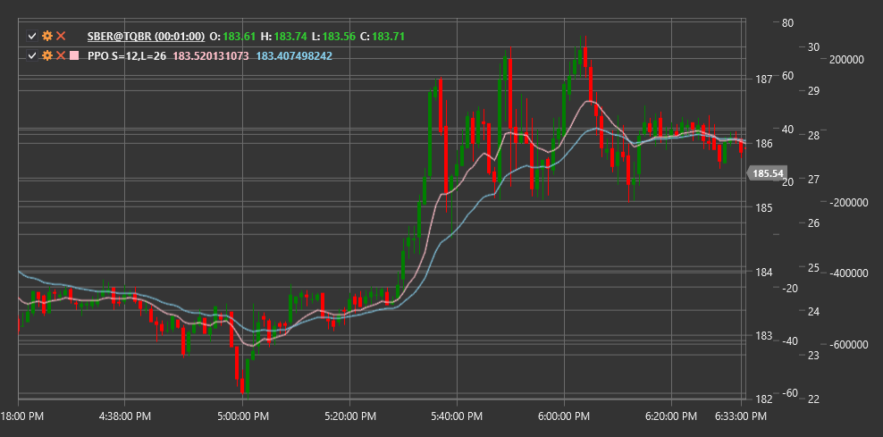

# PPO

**Percentage Price Oscillator (PPO)** is a technical indicator similar to MACD, but expressing the difference between two exponential moving averages as a percentage rather than in absolute values.

To use the indicator, you need to use the [PercentagePriceOscillator](xref:StockSharp.Algo.Indicators.PercentagePriceOscillator) class.

## Description

The Percentage Price Oscillator (PPO) is a variation of the more well-known MACD (Moving Average Convergence Divergence) indicator. The main difference is that PPO expresses the difference between two exponential moving averages as a percentage, rather than in absolute units. This makes PPO particularly useful when comparing different instruments with varying price levels or analyzing a single instrument over a long period when its price has changed significantly.

PPO consists of three components:
1. **PPO Line** - difference between fast and slow EMA, expressed as a percentage
2. **Signal Line** - EMA of the PPO line
3. **Histogram** - difference between the PPO line and signal line

The PPO indicator oscillates around the zero line, where positive values indicate a bullish market sentiment, and negative values indicate a bearish sentiment. The magnitude of deviation from zero reflects the strength of the current trend.

## Parameters

The indicator has the following parameters:
- **ShortPeriod** - period for calculating short EMA (default value: 12)
- **LongPeriod** - period for calculating long EMA (default value: 26)

## Calculation

Percentage Price Oscillator calculation involves the following steps:

1. Calculate short and long exponential moving averages:
   ```
   Short EMA = EMA(Price, ShortPeriod)
   Long EMA = EMA(Price, LongPeriod)
   ```

2. Calculate PPO line as a percentage difference between short and long EMA:
   ```
   PPO Line = ((Short EMA - Long EMA) / Long EMA) * 100
   ```

3. Calculate signal line (typically 9-period EMA of PPO line):
   ```
   Signal Line = EMA(PPO Line, 9)
   ```

4. Calculate histogram:
   ```
   Histogram = PPO Line - Signal Line
   ```

Where:
- Price - price (usually closing price)
- EMA - exponential moving average
- ShortPeriod - period for short EMA
- LongPeriod - period for long EMA

## Interpretation

The Percentage Price Oscillator can be interpreted as follows:

1. **Zero Line Crossovers**:
   - PPO line crossing the zero line from bottom to top can be viewed as a bullish signal
   - PPO line crossing the zero line from top to bottom can be viewed as a bearish signal

2. **Signal Line Crossovers**:
   - PPO line crossing the signal line from bottom to top can be viewed as a bullish signal
   - PPO line crossing the signal line from top to bottom can be viewed as a bearish signal

3. **Divergences**:
   - Bullish Divergence: price forms a new low, while PPO forms a higher low
   - Bearish Divergence: price forms a new high, while PPO forms a lower high

4. **Overbought/Oversold**:
   - Extremely high positive PPO values may indicate market overbought conditions
   - Extremely low negative PPO values may indicate market oversold conditions

5. **Histogram Analysis**:
   - Histogram expansion indicates strengthening of the current trend
   - Histogram contraction indicates weakening of the current trend
   - Change in histogram color (or sign) indicates a change in short-term momentum

6. **Instrument Comparison**:
   - Unlike MACD, PPO can be used for direct comparison of different instruments
   - Higher PPO values for one instrument compared to another may indicate stronger relative momentum

7. **Signal Filtering**:
   - Signal line crossover signals are more reliable when PPO is in line with the main trend
   - For example, bullish signals are more reliable when PPO is positive, and bearish signals are more reliable when PPO is negative



## See Also

[MACD](macd.md)
[EMA](ema.md)
[PercentageVolumeOscillator](percentage_volume_oscillator.md)
[TRIX](trix.md)