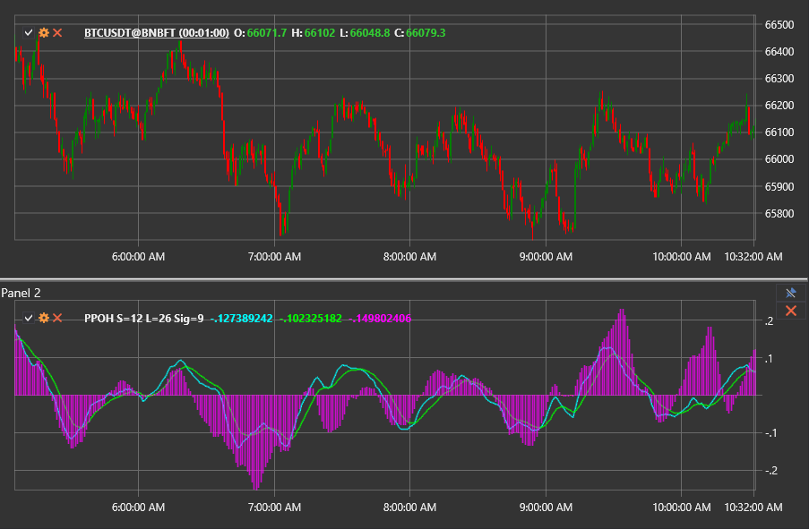

# Percentage Price Oscillator Histogram

The **Percentage Price Oscillator Histogram (PPOH)** displays the distance between the PPO line and its signal line as a histogram, helping traders immediately evaluate the momentum balance.

To use the indicator, employ the [PercentagePriceOscillatorHistogram](xref:StockSharp.Algo.Indicators.PercentagePriceOscillatorHistogram) class.

## Description

The PPO histogram is derived from the standard Percentage Price Oscillator (PPO). Instead of plotting both the PPO and signal lines, it visualises their difference as bars around the zero level. Positive bars indicate that the PPO line is above the signal line (bullish momentum), whereas negative bars show that the PPO line is below the signal line (bearish momentum).

The histogram reacts quickly to changes in the spread between the PPO and the signal line, making it suitable for spotting early shifts in trend strength or identifying momentum divergences.

## Calculation

1. Calculate the PPO line and its signal line using the desired periods.
2. Subtract the signal line from the PPO line to obtain the histogram value.

```
Histogram = PPO - Signal
```

Values above zero highlight bullish pressure, while those below zero reflect bearish pressure. The rate at which the histogram bars expand or contract provides clues about the momentum acceleration or deceleration.

## Interpretation

- **Zero line crossovers.** Moving above zero confirms that the PPO line has crossed above the signal line, suggesting a bullish shift. Falling below zero indicates a bearish crossover.
- **Momentum surges.** Rapid growth of positive bars suggests strengthening bullish momentum; shrinking bars hint at weakening strength and a possible reversal.
- **Divergences.** Divergence between price action and the histogram can alert traders to potential trend exhaustion before it becomes visible on price charts.



## See Also

- [Percentage Price Oscillator](percentage_price_oscillator.md)
- [Percentage Price Oscillator Signal](percentage_price_oscillator_signal.md)
