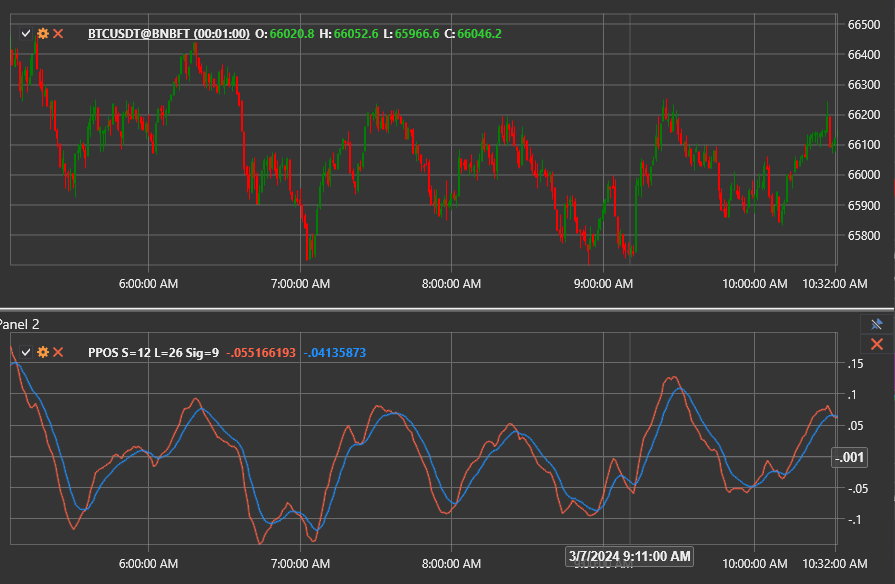

# Percentage Price Oscillator Signal

The **Percentage Price Oscillator Signal (PPOS)** indicator augments the standard Percentage Price Oscillator by adding the accompanying signal line that is typically used to filter trades.

To use the indicator, employ the [PercentagePriceOscillatorSignal](xref:StockSharp.Algo.Indicators.PercentagePriceOscillatorSignal) class.

## Description

The Percentage Price Oscillator (PPO) measures the percentage difference between two exponential moving averages (EMAs). The signal version focuses on smoothing the PPO line with an additional EMA, helping traders react only to the more persistent shifts in momentum.

The indicator is formed by the following components:

1. **PPO line** – the percentage difference between the fast and slow EMAs.
2. **Signal line** – an EMA calculated from the PPO line (9 periods by default).

When the PPO line crosses above the signal line, it suggests increasing bullish momentum; crossing below signals strengthening bearish momentum. Remaining above or below the signal line can confirm the strength of the prevailing trend.

## Calculation

1. Compute the fast and slow EMAs of the selected price series.
2. Calculate the PPO line as the percentage distance between the fast and slow EMAs.
3. Smooth the PPO line with an EMA to obtain the signal line.

```
FastEMA = EMA(Price, ShortPeriod)
SlowEMA = EMA(Price, LongPeriod)
PPO = ((FastEMA - SlowEMA) / SlowEMA) * 100
Signal = EMA(PPO, SignalPeriod)
```

## Interpretation

- **Signal crossovers.** A bullish signal occurs when the PPO line crosses the signal line from below; the opposite crossover points to bearish momentum.
- **Trend confirmation.** Holding above the signal line confirms an uptrend, while staying below supports a downtrend.
- **Divergences.** Divergence between price action and the PPO line while it interacts with the signal line can anticipate reversals.



## See Also

- [Percentage Price Oscillator](percentage_price_oscillator.md)
- [Percentage Price Oscillator Histogram](percentage_price_oscillator_histogram.md)
