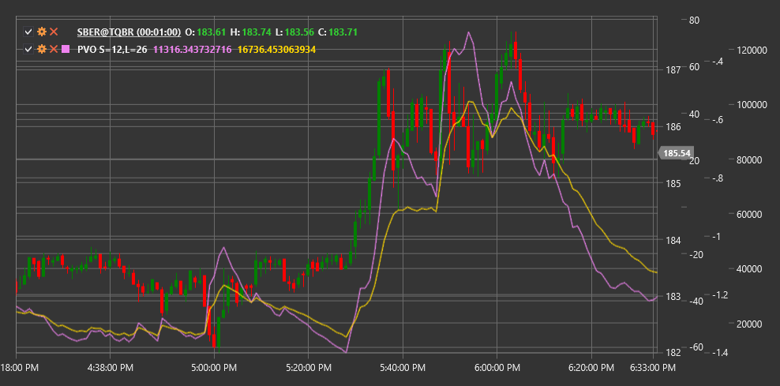

# PVO

**Percentage Volume Oscillator (PVO)** is a technical indicator similar to MACD, but applied to trading volume instead of price, expressing the difference between fast and slow exponential moving averages of volume as a percentage.

To use the indicator, you need to use the [PercentageVolumeOscillator](xref:StockSharp.Algo.Indicators.PercentageVolumeOscillator) class.

## Description

The Percentage Volume Oscillator (PVO) is a modification of the MACD (Moving Average Convergence Divergence) indicator, applied to trading volume instead of price. Similar to PPO (Percentage Price Oscillator), PVO expresses the difference between fast and slow exponential moving averages as a percentage, rather than in absolute units. This makes PVO particularly useful when comparing different instruments with varying volume levels or analyzing a single instrument over an extended period.

PVO consists of three components:
1. **PVO Line** - percentage difference between fast and slow volume EMA
2. **Signal Line** - EMA of the PVO line
3. **Histogram** - difference between the PVO line and signal line

The PVO indicator helps identify volume anomalies that may precede significant price movements. It is also useful for confirming price trends and identifying potential reversal points.

## Parameters

The indicator has the following parameters:
- **ShortPeriod** - period for calculating short volume EMA (default value: 12)
- **LongPeriod** - period for calculating long volume EMA (default value: 26)

## Calculation

Percentage Volume Oscillator calculation involves the following steps:

1. Calculate short and long exponential moving averages of volume:
   ```
   Short EMA = EMA(Volume, ShortPeriod)
   Long EMA = EMA(Volume, LongPeriod)
   ```

2. Calculate PVO line as a percentage difference between short and long EMA:
   ```
   PVO Line = ((Short EMA - Long EMA) / Long EMA) * 100
   ```

3. Calculate signal line (typically 9-period EMA of PVO line):
   ```
   Signal Line = EMA(PVO Line, 9)
   ```

4. Calculate histogram:
   ```
   Histogram = PVO Line - Signal Line
   ```

Where:
- Volume - trading volume
- EMA - exponential moving average
- ShortPeriod - period for short EMA
- LongPeriod - period for long EMA

## Interpretation

The Percentage Volume Oscillator can be interpreted as follows:

1. **Zero Line Crossovers**:
   - PVO line crossing the zero line from bottom to top indicates volume acceleration above average, which may herald a bullish movement
   - PVO line crossing the zero line from top to bottom indicates volume deceleration below average, which may herald a bearish movement

2. **Signal Line Crossovers**:
   - PVO line crossing the signal line from bottom to top can be viewed as a bullish signal
   - PVO line crossing the signal line from top to bottom can be viewed as a bearish signal

3. **Divergences**:
   - Bullish Divergence: price forms a new low, while PVO forms a higher low
   - Bearish Divergence: price forms a new high, while PVO forms a lower high

4. **Extreme Values**:
   - Very high PVO values may indicate excessive volume, often occurring during market peaks or panic
   - Very low PVO values may indicate insufficient volume, often occurring during market lulls

5. **Histogram Analysis**:
   - Increasing positive histogram indicates strengthening bullish volume momentum
   - Increasing negative histogram indicates strengthening bearish volume momentum
   - Histogram contraction indicates weakening of current volume momentum

6. **Price Trend Confirmation**:
   - Rising PVO confirms an upward price trend
   - Falling PVO confirms a downward price trend
   - Divergence between PVO direction and price may signal a potential reversal

7. **Volume Spikes**:
   - Sharp PVO jumps indicate significant volume changes, often accompanying important market events
   - Such spikes may precede or accompany breakouts of key price levels



## See Also

[PPO](percentage_price_oscillator.md)
[OBV](on_balance_volume.md)
[MACD](macd.md)
[ChaikinMoneyFlow](chaikin_money_flow.md)