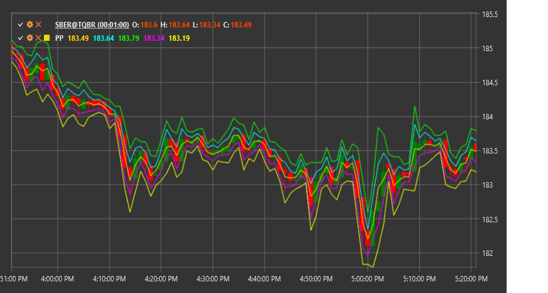

# PP

**Pivot Points (PP)** is a technical indicator that uses previous high, low, and closing prices to determine potential support and resistance levels for the current trading period.

To use the indicator, you need to use the [PivotPoints](xref:StockSharp.Algo.Indicators.PivotPoints) class.

## Description

Pivot Points (pivot points) are one of the oldest and most widely used methods for identifying key market levels. The indicator calculates the central pivot point (PP) and several support (S1, S2, S3) and resistance (R1, R2, R3) levels based on the previous period's data.

Originally, Pivot Points were used by traders on exchange floors to determine key levels for the current trading day based on the previous day's data. Today, this method has been adapted for various timeframes - from intraday to monthly.

The main idea behind Pivot Points is that the market tends to react to these pre-calculated levels, using them as reversal points or zones where consolidation may occur. Traders use these levels to make decisions about market entry and exit, as well as to set target levels and stop-losses.

## Calculation

There are several methods for calculating Pivot Points, including standard, Fibonacci, Woodie, Camarilla, and DeMark. Below is the standard calculation method:

1. Calculate the main pivot point (PP):
   ```
   PP = (High + Low + Close) / 3
   ```

2. Calculate the first resistance (R1) and support (S1) levels:
   ```
   R1 = (2 * PP) - Low
   S1 = (2 * PP) - High
   ```

3. Calculate the second resistance (R2) and support (S2) levels:
   ```
   R2 = PP + (High - Low)
   S2 = PP - (High - Low)
   ```

4. Calculate the third resistance (R3) and support (S3) levels:
   ```
   R3 = High + 2 * (PP - Low)
   S3 = Low - 2 * (High - PP)
   ```

Where:
- High - highest price of the previous period
- Low - lowest price of the previous period
- Close - closing price of the previous period

## Interpretation

Pivot Points can be interpreted as follows:

1. **Main Pivot Point (PP)**:
   - PP serves as the primary reference for determining overall market sentiment
   - If the price is above PP, it indicates a bullish sentiment
   - If the price is below PP, it indicates a bearish sentiment
   - PP can also serve as a support or resistance level

2. **Resistance Levels (R1, R2, R3)**:
   - These levels represent potential resistance zones in a bullish market
   - A breakout of a level may lead to continued movement to the next level
   - A bounce from a level may lead to a downward reversal

3. **Support Levels (S1, S2, S3)**:
   - These levels represent potential support zones in a bearish market
   - A breakout of a level may lead to continued movement to the next level
   - A bounce from a level may lead to an upward reversal

4. **Trading Strategies**:
   - **Bounce Trading**: Enter a position when bouncing off a support or resistance level
   - **Breakout Trading**: Enter a position after a confirmed level breakout
   - **Range Trading**: Buy at support levels and sell at resistance levels
   - **Target Setting**: Use the next level as a profit-taking target
   - **Stop-Loss Placement**: Place stop-losses beyond the corresponding levels

5. **Combining with Other Indicators**:
   - Pivot Points are often used in combination with other technical indicators to confirm signals
   - Particularly effective when combined with momentum indicators (RSI, Stochastic) and trend indicators (MA, MACD)

6. **Timeframes**:
   - Daily Pivot Points are calculated based on the previous trading day
   - Weekly Pivot Points are calculated based on the previous week
   - Monthly Pivot Points are calculated based on the previous month
   - Timeframe selection depends on trading style and time horizon



## See Also

[FibonacciRetracement](fibonacci_retracement.md)