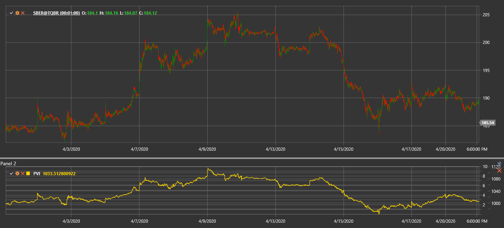

# PVI

**Positive Volume Index (PVI)** is a technical indicator developed by Paul Dysart that focuses on price changes on days when trading volume increases compared to the previous day.

To use the indicator, you need to use the [PositiveVolumeIndex](xref:StockSharp.Algo.Indicators.PositiveVolumeIndex) class.

## Description

The Positive Volume Index (PVI) is based on the idea that the "crowd" (non-professional traders) is more active on high-volume days, while "smart money" acts on low-volume days. PVI changes only on days when the current volume is higher than the previous day's volume.

The indicator suggests that price movements on increased volume are significant and often reflect mass-market sentiment. PVI tracks these movements, ignoring price changes on days with lower volume.

PVI is often used together with the complementary Negative Volume Index (NVI), which, in contrast, considers only days when volume decreases.

## Calculation

Positive Volume Index calculation involves the following steps:

1. Set initial PVI value (usually 1000):
   ```
   PVI[initial] = 1000
   ```

2. For each subsequent period:
   ```
   If Volume[current] > Volume[previous], then:
       PVI[current] = PVI[previous] * (1 + (Price[current] - Price[previous]) / Price[previous])
   Otherwise:
       PVI[current] = PVI[previous]
   ```

Where:
- Price - price (usually closing price)
- Volume - trading volume

In other words, PVI changes only on days when trading volume increases and remains unchanged on days with decreasing or unchanged volume.

## Interpretation

The Positive Volume Index can be interpreted as follows:

1. **Trend Analysis**:
   - Rising PVI indicates that the "crowd" is buying, which may foretell future price increase
   - Falling PVI indicates that the "crowd" is selling, which may foretell future price decline

2. **Moving Average Crossovers**:
   - PVI is often compared to its 255-day moving average (approximately one year of trading)
   - When PVI is above its 255-day SMA, it is considered a bullish signal
   - When PVI is below its 255-day SMA, it is considered a bearish signal

3. **Divergences**:
   - Bullish Divergence: price forms a new low, while PVI forms a higher low
   - Bearish Divergence: price forms a new high, while PVI forms a lower high

4. **Combining with NVI**:
   - When both PVI and NVI are rising, it's a strong bullish signal
   - When both PVI and NVI are falling, it's a strong bearish signal
   - When PVI rises and NVI falls, it may indicate the "crowd" buying while "smart money" sells (potentially bullish scenario)
   - When PVI falls and NVI rises, it may indicate the "crowd" selling while "smart money" buys (potentially bearish scenario)

5. **Long-Term Changes**:
   - PVI is often viewed as a long-term indicator
   - Sustained change in PVI direction may signal a significant shift in market sentiment

6. **Confirming Other Indicators**:
   - PVI works best when combined with other technical indicators and analysis methods
   - PVI signals become more reliable when confirmed by other indicators

7. **Setting Thresholds**:
   - Some traders set threshold levels for PVI (e.g., 5% above or below the moving average)
   - Crossing these thresholds may be considered a stronger signal than simple crossovers



## See Also

[OBV](on_balance_volume.md)
[ADL](accumulation_distribution_line.md)
[ChaikinMoneyFlow](chaikin_money_flow.md)
[ForceIndex](force_index.md)
[NegativeVolumeIndex](negative_volume_index.md)
