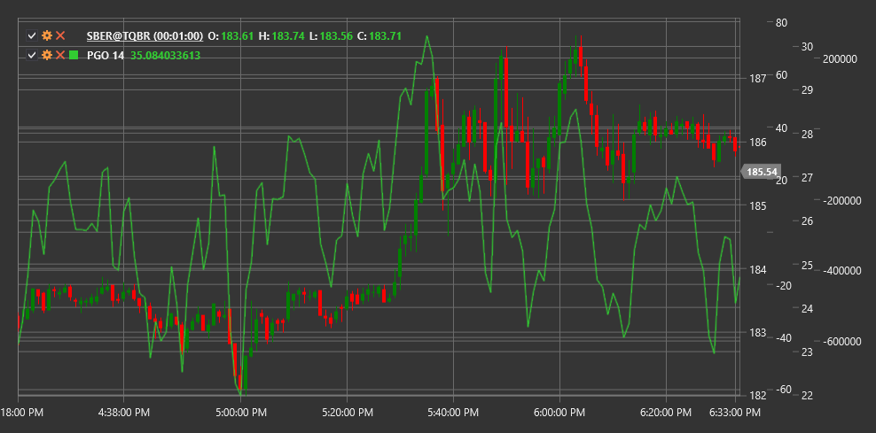

# PGO

**Pretty Good Oscillator (PGO)** is a technical indicator developed by Mark Johnson that compares the current closing price with previous prices, considering volatility, to determine market overbought or oversold conditions.

To use the indicator, you need to use the [PrettyGoodOscillator](xref:StockSharp.Algo.Indicators.PrettyGoodOscillator) class.

## Description

The Pretty Good Oscillator (PGO) is an indicator that evaluates the strength of the current closing price relative to its historical values over a specific period. PGO takes into account not only the current price's position in the historical range but also the volatility of this range, making it more adaptive to changing market conditions.

The name "Pretty Good Oscillator" reflects its creator's pragmatic approach - the indicator does not claim to be a perfect tool, but offers a "pretty good" way of assessing the current market situation.

PGO is particularly useful for identifying overbought and oversold conditions, as well as detecting divergences that may precede trend reversals.

## Parameters

The indicator has the following parameters:
- **Length** - calculation period (default value: 14)

## Calculation

Pretty Good Oscillator calculation involves the following steps:

1. Determine the highest high (Highest High) and lowest low (Lowest Low) over the specified period:
   ```
   Highest High = Highest(High, Length)
   Lowest Low = Lowest(Low, Length)
   ```

2. Calculate the standard deviation of closing prices over the specified period:
   ```
   Standard Deviation = StdDev(Close, Length)
   ```

3. Calculate the Pretty Good Oscillator:
   ```
   PGO = (Close - (Highest High + Lowest Low) / 2) / Standard Deviation
   ```

Where:
- Close - current closing price
- High - highest price
- Low - lowest price
- Length - calculation period
- StdDev - standard deviation

## Interpretation

The Pretty Good Oscillator can be interpreted as follows:

1. **Overbought and Oversold Levels**:
   - Values above +2 often indicate market overbought conditions
   - Values below -2 often indicate market oversold conditions
   - Extreme values (+3/-3 and above/below) may signal significant overbought/oversold conditions and potential reversal

2. **Zero Line Crossovers**:
   - PGO crossing the zero line from bottom to top can be viewed as a bullish signal
   - PGO crossing the zero line from top to bottom can be viewed as a bearish signal

3. **Divergences**:
   - Bullish Divergence: price forms a new low, while PGO forms a higher low
   - Bearish Divergence: price forms a new high, while PGO forms a lower high
   - Divergences often precede significant trend reversals

4. **Trend Confirmation**:
   - Positive PGO values indicate that the price is above the average range, characteristic of an upward trend
   - Negative PGO values indicate that the price is below the average range, characteristic of a downward trend

5. **Trend Strength Assessment**:
   - The further the PGO value is from zero, the stronger the current trend
   - PGO converging with the zero line may indicate trend weakening

6. **Signal Filtering**:
   - PGO can be used to filter signals from other indicators
   - For example, consider only bullish signals when PGO is positive, and only bearish signals when PGO is negative

7. **Position Exits**:
   - Extreme PGO values can be used as signals to take profits
   - For example, exit long positions when PGO exceeds +2, and short positions when PGO falls below -2



## See Also

[RSI](rsi.md)
[StochasticOscillator](stochastic_oscillator.md)
[CCI](cci.md)
[StandardDeviation](standard_deviation.md)