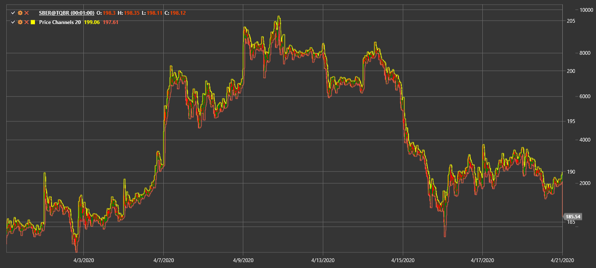

# Price Channels

**Price Channels (PC)** display upper and lower boundaries of price movement over a specified period.

To use the indicator, you must use the [PriceChannels](xref:StockSharp.Algo.Indicators.PriceChannels) class.

## Recommended content

[Donchian Channels](donchian_channels.md)
