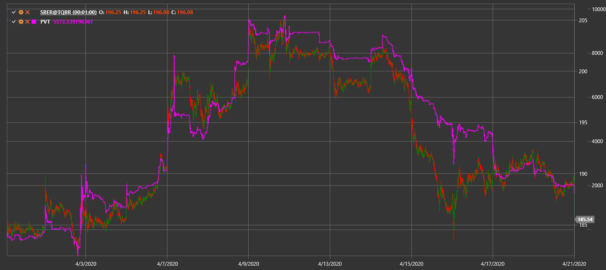

# PVT

**Price Volume Trend (PVT)** is a cumulative indicator that multiplies price change by volume to show buying or selling pressure.

To use the indicator, you must use the [PriceVolumeTrend](xref:StockSharp.Algo.Indicators.PriceVolumeTrend) class.

## Recommended content

[On-Balance Volume](on_balance_volume.md)
