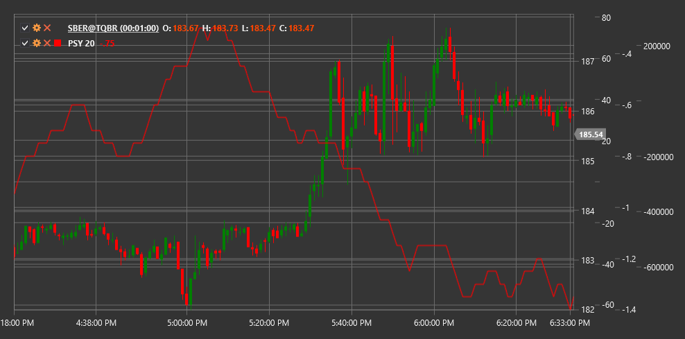

# PSY

**Psychological Line (PSY)** is a technical indicator that measures the proportion of rising periods (candles, bars) relative to the total number of periods over a specified time interval.

To use the indicator, you need to use the [PsychologicalLine](xref:StockSharp.Algo.Indicators.PsychologicalLine) class.

## Description

The Psychological Line (PSY) is a simple but effective indicator that reflects market sentiment by calculating the percentage of price-rising periods compared to the total number of periods considered. The indicator is based on the assumption that market psychology and investor sentiment play a crucial role in price movements.

PSY is an oscillator with values ranging from 0 to 100, where:
- A value of 100 means the price rose in all considered periods
- A value of 0 means the price fell in all considered periods
- A value of 50 means an equal number of rising and falling periods

The PSY indicator helps determine whether the market is in an overbought or oversold condition and can predict potential trend reversals.

## Parameters

The indicator has the following parameters:
- **Length** - calculation period (default value: 12-14)

## Calculation

The Psychological Line calculation is very simple:

```
PSY = (Number of rising periods over Length periods / Length) * 100
```

Where:
- A rising period is defined as a period where the closing price is higher than the previous period's closing price
- Length - number of periods considered

## Interpretation

The Psychological Line can be interpreted as follows:

1. **Overbought and Oversold Levels**:
   - Values above 70-80 indicate market overbought conditions (too many periods were rising)
   - Values below 20-30 indicate market oversold conditions (too many periods were falling)
   - Extreme values often precede trend reversals

2. **Centerline (50)**:
   - Crossing the 50 level from bottom to top can be viewed as a bullish signal
   - Crossing the 50 level from top to bottom can be viewed as a bearish signal
   - Sustained movement above 50 indicates bull dominance
   - Sustained movement below 50 indicates bear dominance

3. **Divergences**:
   - Bullish Divergence: price forms a new low, while PSY forms a higher low
   - Bearish Divergence: price forms a new high, while PSY forms a lower high

4. **Rebounds from Extreme Levels**:
   - PSY reversal from the overbought zone may signal a potential bearish reversal
   - PSY reversal from the oversold zone may signal a potential bullish reversal

5. **Trend Analysis**:
   - In a strong upward trend, PSY often remains above 50, with periodic rebounds from the overbought zone
   - In a strong downward trend, PSY often remains below 50, with periodic rebounds from the oversold zone

6. **Length Parameter Tuning**:
   - Shorter periods (e.g., 5-8) make PSY more sensitive and suitable for short-term trading
   - Longer periods (e.g., 20-25) make PSY smoother and suitable for long-term trading

7. **Combining with Other Indicators**:
   - PSY is often used in combination with other indicators to confirm signals
   - Particularly useful when combined with trend indicators and volume indicators



## See Also

[RSI](rsi.md)
[StochasticOscillator](stochastic_oscillator.md)
[UltimateOscillator](uo.md)
[MomentumOscillator](momentum.md)