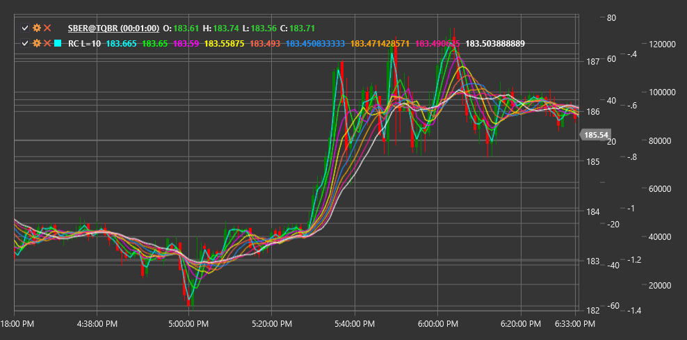

# RC

**Rainbow Charts (RC)** is a technical analysis indicator consisting of a set of moving averages with different periods displayed on a single chart. Visually, the indicator resembles a rainbow, hence its name.

To use the indicator, you need to use the [RainbowCharts](xref:StockSharp.Algo.Indicators.RainbowCharts) class.

## Description

Rainbow Charts are based on using multiple moving averages (usually simple SMA) with progressively increasing periods. Different moving average lines are colored in different colors, creating a rainbow effect on the chart.

The indicator helps determine trend direction and strength:
- When lines diverge, this indicates trend strengthening
- When lines converge, this may signal trend weakening or a potential reversal
- When the price is above all lines, it indicates a strong upward trend
- When the price is below all lines, it indicates a strong downward trend

## Parameters

- **Lines** - number of SMA moving averages used in the rainbow chart.

## Calculation

Rainbow Charts consist of multiple moving averages (SMA), with each subsequent line's period increasing by a certain step. For n lines with a base period p, periods are calculated as:

```
Period(i) = p + i * step
```

Where:
- i - line number (from 0 to n-1)
- step - period increase step (usually 1)



## See Also

[SMA](sma.md)