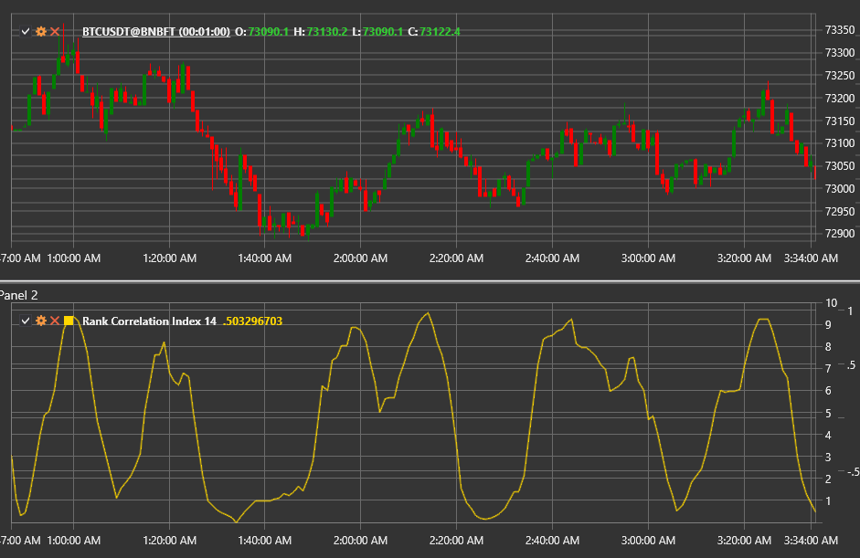

# Rank Correlation Index

The **Rank Correlation Index (RCI)** is an oscillator based on Spearman's rank correlation coefficient. It compares the price ranks
with the time ranks inside the moving window and shows how close the recent movement is to a perfectly rising or falling sequence.

Use the [RankCorrelationIndex](xref:StockSharp.Algo.Indicators.RankCorrelationIndex) class to access the indicator.

## Calculation

1. Assign each data point inside the **Length** window a time rank (1 for the oldest value, `Length` for the most recent).
2. Rank the prices by value (1 for the lowest price, `Length` for the highest).
3. Compute the difference `d = RankTime − RankPrice` for each bar.
4. Apply the Spearman formula:  
   `RCI = 1 − (6 × Σ d²) / (Length × (Length² − 1))`.

When multiplied by 100 the indicator ranges between −100 and +100.

## Parameters

- **Length** — window size for the ranking procedure.

## Interpretation

- **RCI ≈ +100** — perfectly rising sequence (strong uptrend).
- **RCI ≈ −100** — perfectly falling sequence (strong downtrend).
- **RCI around 0** — random or sideways market.
- Divergences between price and the RCI warn of possible reversals.

The indicator is helpful for short-term trend assessment and spotting turning points, especially when combined with momentum tools.

## See also

[Momentum](momentum.md)
[ROC](roc.md)
[RSI](rsi.md)
