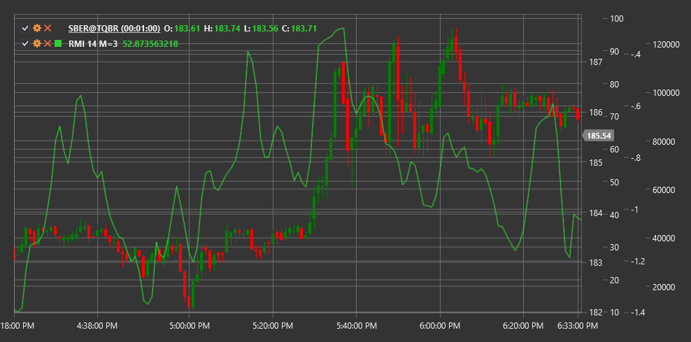

# RMI

**Relative Momentum Index (RMI)** is a modification of the traditional RSI indicator, proposed by Roger Altman. Unlike the classic RSI, which calculates the ratio of price increases and decreases over a certain period, RMI takes into account the relative price change over a selected momentum period.

To use the indicator, you need to use the [RelativeMomentumIndex](xref:StockSharp.Algo.Indicators.RelativeMomentumIndex) class.

## Description

The Relative Momentum Index (RMI) improves the classic RSI by adding a momentum period parameter. This allows traders to adjust the indicator's sensitivity without changing the main calculation period.

Like RSI, RMI oscillates between 0 and 100:
- Values above 70 usually indicate an overbought market
- Values below 30 indicate an oversold market
- The central line at 50 serves as a reference point for determining the main market movement direction

RMI is particularly useful for identifying potential trend reversal points and confirming the strength of the current trend.

## Parameters

- **MomentumPeriod** - momentum period that defines the time lag for price comparison.
- **Length** - main period for calculating the indicator (similar to the period in RSI).

## Calculation

The RMI calculation is performed in several steps:

1. Calculate momentum as the difference between the current price and the price n periods ago:
   ```
   Momentum = Price(current) - Price(current - MomentumPeriod)
   ```

2. Divide momentums into positive (U) and negative (D):
   ```
   If Momentum > 0, then U = Momentum, D = 0
   If Momentum < 0, then U = 0, D = |Momentum|
   ```

3. Calculate the average values of positive and negative momentums over the specified period:
   ```
   AverageU = SMA(U, Length)
   AverageD = SMA(D, Length)
   ```

4. Calculate relative strength:
   ```
   RS = AverageU / AverageD
   ```

5. Convert to Relative Momentum Index:
   ```
   RMI = 100 - (100 / (1 + RS))
   ```



## See Also

[RSI](rsi.md)
[Momentum](momentum.md)