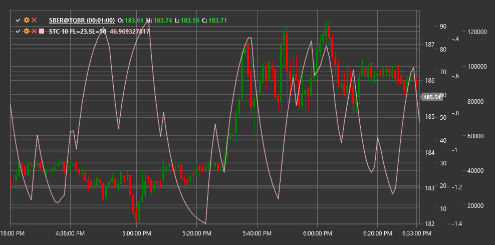

# STC

**Schaff Trend Cycle (STC)** is a momentum indicator developed by Doug Schaff. STC is based on the assumption that market cycles more frequently move between overbought and oversold conditions rather than in a true trend.

To use the indicator, you need to use the [SchaffTrendCycle](xref:StockSharp.Algo.Indicators.SchaffTrendCycle) class.

## Description

The Schaff Trend Cycle combines the advantages of the Stochastic Oscillator, MACD, and cyclical analysis. This indicator can react to trend changes faster than traditional indicators such as MACD or Stochastic.

STC oscillates between 0 and 100:
- Values above 75 usually indicate overbought conditions
- Values below 25 indicate oversold conditions
- Crossing the 50 level may signal a trend change

Main indicator signals:
- Buy when STC crosses the 25 level from bottom to top (exiting oversold zone)
- Sell when STC crosses the 75 level from top to bottom (exiting overbought zone)

## Parameters

- **Length** - main period for calculating the indicator.

## Calculation

The STC calculation is performed in several steps:

1. Calculate MACD:
   ```
   MACD = EMA(Close, Fast) - EMA(Close, Slow)
   Signal = EMA(MACD, Signal)
   ```
   where Fast, Slow, and Signal are typically 23, 50, and 10 respectively.

2. Calculate Stochastic Oscillator based on MACD:
   ```
   Stoch_K = 100 * ((MACD - Lowest(MACD, Length)) / (Highest(MACD, Length) - Lowest(MACD, Length)))
   Stoch_D = EMA(Stoch_K, 3)
   ```

3. Repeat stochastic calculation to obtain STC:
   ```
   STC = 100 * ((Stoch_D - Lowest(Stoch_D, Length)) / (Highest(Stoch_D, Length) - Lowest(Stoch_D, Length)))
   ```

The result is an oscillator that is smoother than the classic Stochastic and reacts faster to trend changes than MACD.



## See Also

[MACD](macd.md)
[Stochastic](stochastic_oscillator.md)