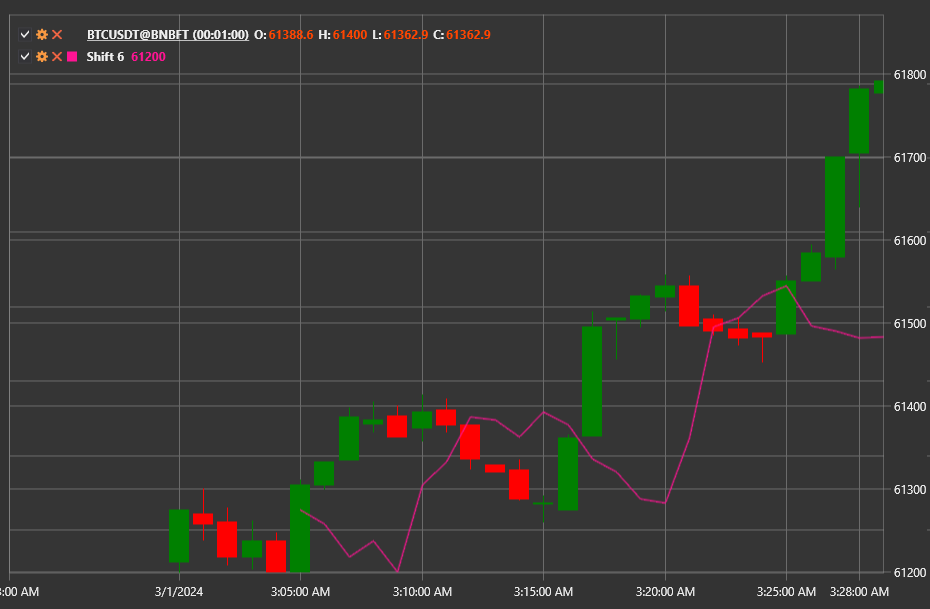

# Shift

**Shift** is a helper indicator that offsets the incoming value stream by a specified number of periods. It does not transform the
data; it only delays or aligns it for use in composite calculations.

Use the [Shift](xref:StockSharp.Algo.Indicators.Shift) class to access the indicator.

## Description

The indicator keeps a buffer of the latest values and outputs the one that arrived **Length** bars ago. If the data history is
shorter than the required offset, the value is considered undefined.

## Parameters

- **Length** — number of periods by which the data is shifted.

## Usage

- Align signals from different indicators in time.
- Build custom indicators and strategies that require delayed inputs.
- Create synthetic series, for example, to compute the difference between current prices and past values.

## See also

[PassThrough](pass_through.md)
[Sum](sum_n.md)
