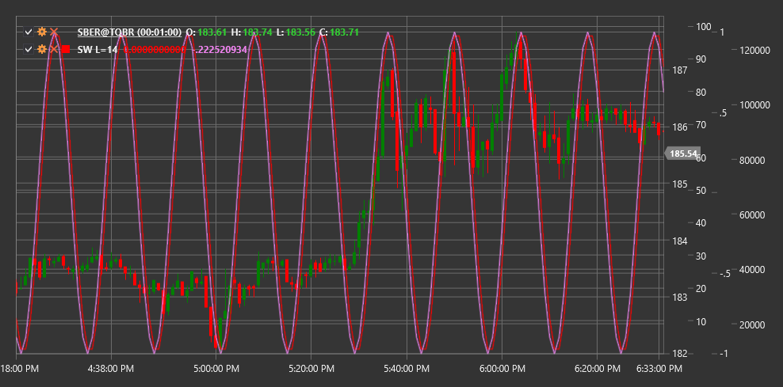

# SW

**Sine Wave (SW)** is a technical indicator that uses the sine mathematical function to identify cyclical patterns in price movement. The indicator aims to identify and predict periodic market oscillations.

To use the indicator, you need to use the [SineWave](xref:StockSharp.Algo.Indicators.SineWave) class.

## Description

The Sine Wave indicator is based on the idea that market movements have a cyclical nature and can be modeled using sinusoidal functions. This indicator is particularly useful in markets that move in a sideways range or have predictable cyclical fluctuations.

Key characteristics of the indicator:
- Helps identify potential market reversal points
- Allows determining the current position in the cycle
- Can be used to forecast future price movements

Indicator signals:
- Potential buy when the sine wave line reaches a minimum and begins to turn upward
- Potential sell when the line reaches a maximum and begins to turn downward

## Parameters

- **Length** - period of the sine wave cycle, defining the cycle length in price bars.

## Calculation

The Sine Wave indicator calculation is based on using the sine function and determining the dominant cycle in price movement:

1. Determining the dominant cycle using spectral analysis or another method of cycle identification.

2. Applying the sine function to model the identified cycle:
   ```
   SineWave(t) = A * sin(2π * t / Length + φ)
   ```
   where:
   - A - amplitude (wave height)
   - t - current time or bar
   - Length - cycle length
   - φ - phase shift to align the sine wave with the actual price cycle

3. Additionally, a lead indicator may be calculated, which leads the main sine wave by a quarter cycle:
   ```
   Lead(t) = A * sin(2π * t / Length + φ + π/2)
   ```

The indicator may include additional components such as a trend line or filter to improve signal accuracy.



## See Also

[Schaff Trend Cycle](schaff_trend_cycle.md)