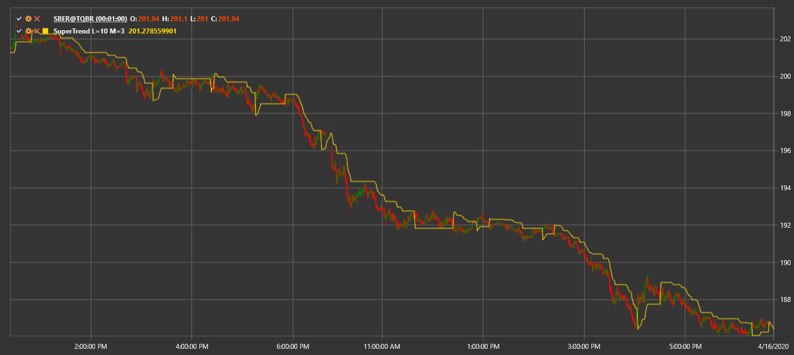

# SuperTrend

**The SuperTrend indicator** is a trend-following indicator based on the Average True Range (ATR). It helps identify the current trend direction and possible reversal points.

To use the indicator, the [SuperTrend](xref:StockSharp.Algo.Indicators.SuperTrend) class should be used.

## Description

SuperTrend is built using the average price and the ATR value. The indicator line switches from above the price to below (and vice versa) when the trend changes. In this way, SuperTrend visually highlights the current trend until the price crosses the indicator line.

## Parameters

- **ATR Length** – the period used for ATR calculation.
- **Multiplier** – the factor that defines how far the line is offset from the average price.

## Calculation

1. Calculate ATR over the chosen period.
2. Compute two boundaries:
   ```
   UpperBand = (High + Low) / 2 + Multiplier * ATR
   LowerBand = (High + Low) / 2 - Multiplier * ATR
   ```
3. SuperTrend initially equals one of the bands depending on the current trend.
4. If the closing price crosses the SuperTrend line, the trend direction changes and the line moves to the opposite side.



## See Also

[ATR](atr.md)
[Parabolic SAR](parabolic_sar.md)
