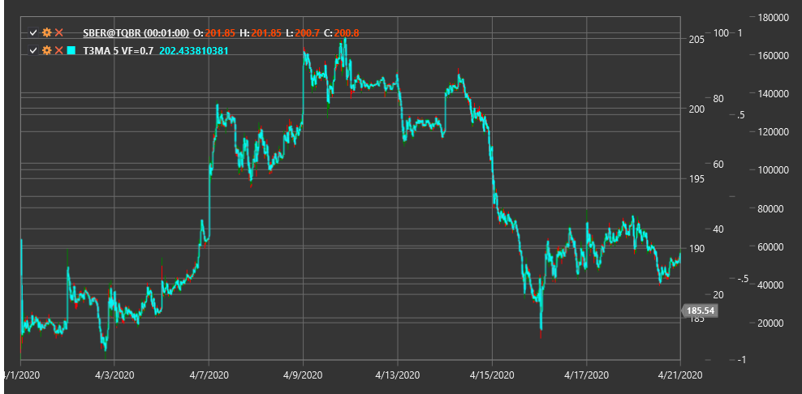

# T3MA

**T3 Moving Average (T3MA)** is an advanced type of moving average developed by Tim Tillson. T3 represents a thrice-smoothed exponential moving average (EMA) with a volume factor, making it smoother and less prone to false signals compared to traditional moving averages.

To use the indicator, you need to use the [T3MovingAverage](xref:StockSharp.Algo.Indicators.T3MovingAverage) class.

## Description

T3 Moving Average was developed to eliminate the drawbacks of traditional moving averages, such as lagging and false signals. Through multiple smoothing and an adjustable volume factor, T3MA provides a smoother curve that more accurately follows the price trend.

Main advantages of T3MA:
- Less lagging compared to ordinary moving averages
- Smoother curve with fewer false signals
- Adaptability to various market conditions due to the adjustable volume factor

T3MA can be used for:
- Determining trend direction
- Finding entry and exit points when price crosses the indicator line
- Building trading systems based on crossovers of multiple T3MAs with different periods

## Parameters

- **VolumeFactor** - volume factor determining the degree of smoothing (usually a value between 0 and 1, recommended value is 0.7).
- **Length** - calculation period, similar to the period in ordinary moving averages.

## Calculation

The T3 Moving Average calculation is performed in several steps:

1. Calculate six consecutive exponential moving averages with the same period:
   ```
   EMA1 = EMA(Price, Length)
   EMA2 = EMA(EMA1, Length)
   EMA3 = EMA(EMA2, Length)
   EMA4 = EMA(EMA3, Length)
   EMA5 = EMA(EMA4, Length)
   EMA6 = EMA(EMA5, Length)
   ```

2. Calculate T3 based on the obtained EMAs and volume factor:
   ```
   c1 = -VolumeFactor^3
   c2 = 3 * VolumeFactor^2 + 3 * VolumeFactor^3
   c3 = -6 * VolumeFactor^2 - 3 * VolumeFactor - 3 * VolumeFactor^3
   c4 = 1 + 3 * VolumeFactor + VolumeFactor^3 + 3 * VolumeFactor^2
   
   T3 = c1 * EMA6 + c2 * EMA5 + c3 * EMA4 + c4 * EMA3
   ```

When VolumeFactor = 0, T3 becomes equivalent to EMA3 (triple EMA). When VolumeFactor = 1, T3 is maximally smoothed.



## See Also

[EMA](ema.md)
[DEMA](dema.md)
[TEMA](tema.md)