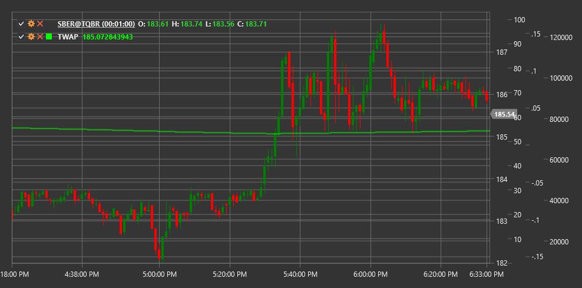

# TWAP

**Time-Weighted Average Price (TWAP)** is an indicator that calculates the average price of a financial instrument weighted by time over a specific period. TWAP is widely used by institutional investors to execute large orders with minimal market impact.

To use the indicator, you need to use the [TimeWeightedAveragePrice](xref:StockSharp.Algo.Indicators.TimeWeightedAveragePrice) class.

## Description

TWAP is one of the most common order execution algorithms that breaks a large order into a series of smaller orders evenly distributed over time. The goal of TWAP is to obtain an average price over a specific time interval while minimizing market impact.

Main applications of TWAP:
- Benchmark price for evaluating order execution quality
- Execution algorithm to minimize market impact
- Tool for market analysis and trading decision-making

Unlike VWAP (Volume Weighted Average Price), TWAP does not consider trading volumes, focusing exclusively on the time aspect.

## Calculation

TWAP calculation is performed by summing prices at equal time intervals and dividing this sum by the number of time intervals:

```
TWAP = (P₁ + P₂ + P₃ + ... + Pₙ) / n
```

where:
- P₁, P₂, ..., Pₙ - prices at successive time moments
- n - number of time intervals

In practical implementation, typical prices for each period (candle) are most often used:

```
Typical Price = (High + Low + Close) / 3
TWAP = Sum(Typical Price) / Number of Periods
```

A recursive formula can also be used to determine the current TWAP value in real-time:

```
TWAP(current) = (TWAP(previous) * (n-1) + P(current)) / n
```

where n is the number of observations in the TWAP window.

