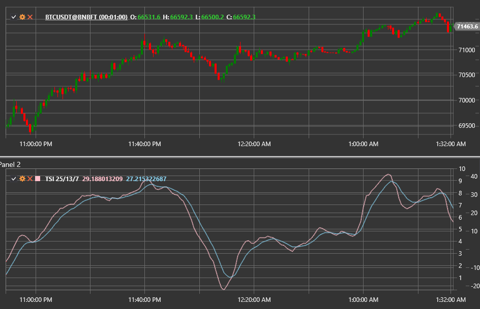

# True Strength Index

The **True Strength Index (TSI)** is a momentum oscillator created by William Blau. It applies double smoothing to the difference
between consecutive closing prices, helping identify trends and turning points with less lag compared with many classic
oscillators.

Use the [TrueStrengthIndex](xref:StockSharp.Algo.Indicators.TrueStrengthIndex) class to access the indicator.

## Calculation

1. Compute the price change `m = Close − PreviousClose`.
2. Apply two exponential moving averages with periods `Length1` and `Length2` to both `m` and `|m|`.
3. Calculate the ratio of the double-smoothed momentum to the double-smoothed absolute momentum:  
   `TSI = 100 × EMA(EMA(m, Length1), Length2) / EMA(EMA(|m|, Length1), Length2)`.
4. Optionally derive a signal line by taking an EMA of the TSI with period **Signal**.

## Parameters

- **Length1** — first smoothing period.
- **Length2** — second smoothing period.
- **Signal** — period of the signal line (optional).

## Interpretation

- **TSI > 0** — bullish momentum.
- **TSI < 0** — bearish momentum.
- **Signal-line crossovers** provide trade entries.
- **Divergences** between TSI and price warn about potential reversals.

Because of the double smoothing and normalisation, the indicator filters out noise yet remains responsive compared with simple
momentum calculations.

## See also

[Momentum](momentum.md)
[MACD](macd.md)
[RSI](rsi.md)
