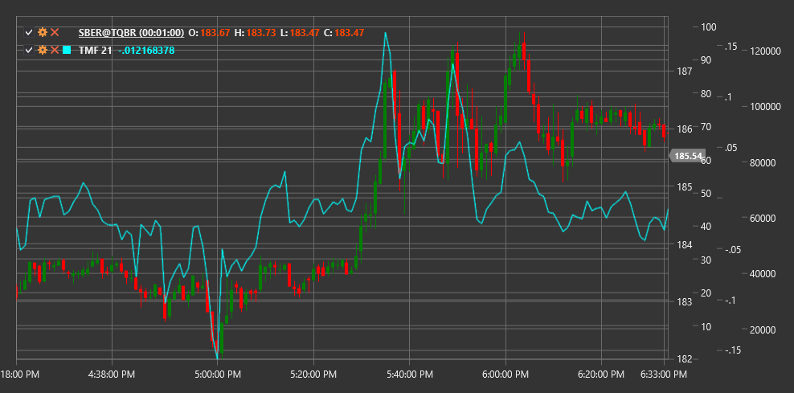

# TMF

**Twiggs Money Flow (TMF)** is a volume indicator developed by Colin Twiggs as an improved version of the Chaikin Money Flow indicator. TMF is more sensitive to changes in market sentiment and has fewer false signals.

To use the indicator, you need to use the [TwiggsMoneyFlow](xref:StockSharp.Algo.Indicators.TwiggsMoneyFlow) class.

## Description

Twiggs Money Flow analyzes the relationship between price and volume to determine the direction of money flow into or out of the market. Unlike traditional volume indicators, TMF eliminates noise by normalizing values between -1 and +1.

Key features of TMF:
- Positive values indicate money inflow into the instrument (bullish sentiment)
- Negative values indicate money outflow from the instrument (bearish sentiment)
- A value of 0 shows balance between supply and demand

The indicator is useful for:
- Confirming the current trend or identifying trend weakness
- Detecting divergences between price and money flow
- Identifying potential market reversal points

## Parameters

- **Length** - calculation period for the exponential moving average, typically using a value of 21.

## Calculation

Twiggs Money Flow calculation is performed in several steps:

1. Calculate True Range:
   ```
   TR = Max(High - Low, |High - Previous Close|, |Low - Previous Close|)
   ```

2. Determine Twiggs Money Flow Volume (TMFV):
   ```
   TMFV = Volume * ((Close - Low - (High - Close)) / TR)
   ```
   When (High - Low = 0), TMFV = 0

3. Calculate exponential moving average of TMFV and volume:
   ```
   EMA_TMFV = EMA(TMFV, Length)
   EMA_Volume = EMA(Volume, Length)
   ```

4. Final TMF value:
   ```
   TMF = EMA_TMFV / EMA_Volume
   ```

TMF values range from -1 (strong bearish signal) to +1 (strong bullish signal).



## See Also

[ADL](accumulation_distribution_line.md)
[Money Flow Index](money_flow_index.md)
[OBV](on_balance_volume.md)