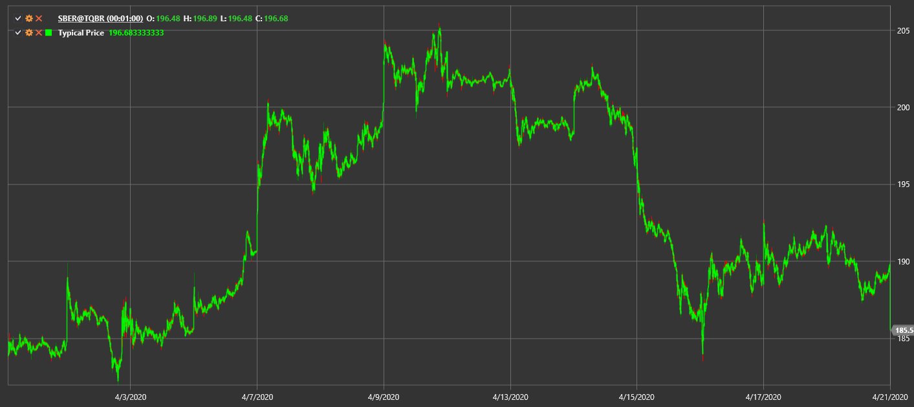

# Typical Price

**Typical Price** calculates the average of high, low, and close values for a candle.

To use the indicator, you must use the [TypicalPrice](xref:StockSharp.Algo.Indicators.TypicalPrice) class.

## Recommended content

[Median Price](median_price.md)
