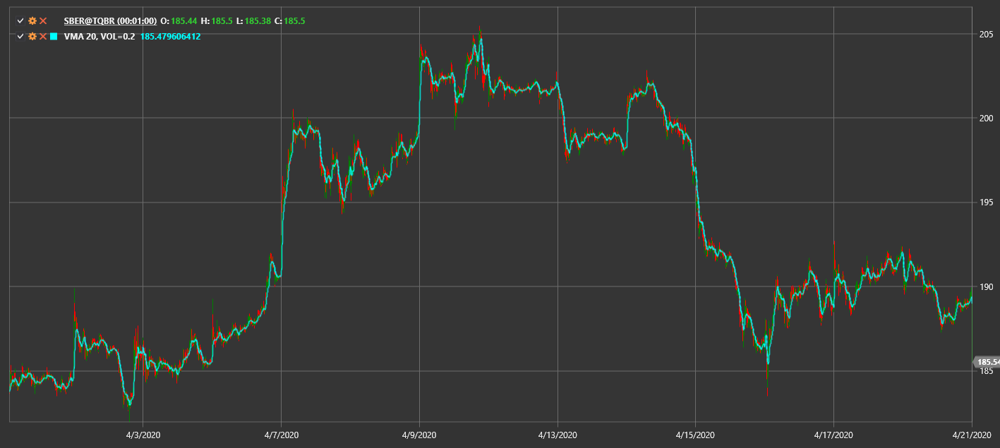

# Variable MA

**Variable Moving Average (VMA)** adapts its smoothing period based on market volatility.

To use the indicator, you must use the [VariableMovingAverage](xref:StockSharp.Algo.Indicators.VariableMovingAverage) class.

## Recommended content

[VIDYA](vidya.md)
