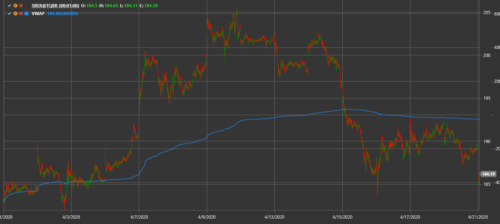

# VWAP

**Volume Weighted Average Price (VWAP)** shows the average price weighted by traded volume.

To use the indicator, you must use the [VolumeWeightedAveragePrice](xref:StockSharp.Algo.Indicators.VolumeWeightedAveragePrice) class.

## Recommended content

[Time Weighted Average Price](time_weighted_average_price.md)
