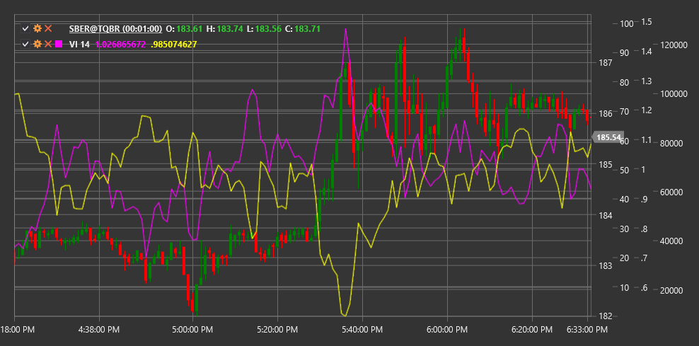

# VI

**Vortex Indicator (VI)** is a technical indicator developed by Etienne and Julia Boisse in 2009. The indicator consists of two lines, VI+ and VI-, which show upward and downward price movement, helping to identify the beginning of new trends and confirm existing ones.

To use the indicator, you need to use the [VortexIndicator](xref:StockSharp.Algo.Indicators.VortexIndicator) class.

## Description

The Vortex Indicator is inspired by the principles of vortex movement in nature and aims to reflect the cyclical nature of market movements. It consists of two lines:

- **VI+** (positive Vortex Indicator) - measures upward price movement
- **VI-** (negative Vortex Indicator) - measures downward price movement

Main indicator signals:
- Buy when VI+ crosses VI- from bottom to top
- Sell when VI- crosses VI+ from bottom to top
- The degree of separation between the lines indicates trend strength

The Vortex Indicator is particularly useful for:
- Determining the start of new trends
- Assessing the strength of an existing trend
- Identifying potential reversal points

## Parameters

- **Length** - calculation period, typically using a value of 14.

## Calculation

The Vortex Indicator calculation is performed in several steps:

1. Calculate positive and negative movement:
   ```
   VM+ = |Current High - Previous Low|
   VM- = |Current Low - Previous High|
   ```

2. Calculate True Range:
   ```
   TR = Max(High - Low, |High - Previous Close|, |Low - Previous Close|)
   ```

3. Sum VM+ and VM- values over the Length period:
   ```
   Sum_VM+ = Sum(VM+, Length)
   Sum_VM- = Sum(VM-, Length)
   ```

4. Sum True Range over the Length period:
   ```
   Sum_TR = Sum(TR, Length)
   ```

5. Calculate normalized VI+ and VI- values:
   ```
   VI+ = Sum_VM+ / Sum_TR
   VI- = Sum_VM- / Sum_TR
   ```

The crossing of these two lines generates trading signals: when VI+ rises above VI-, it signals a bullish trend, and conversely, when VI- rises above VI+, it signals a bearish trend.



## See Also

[ADX](adx.md)
[DMI](dmi.md)