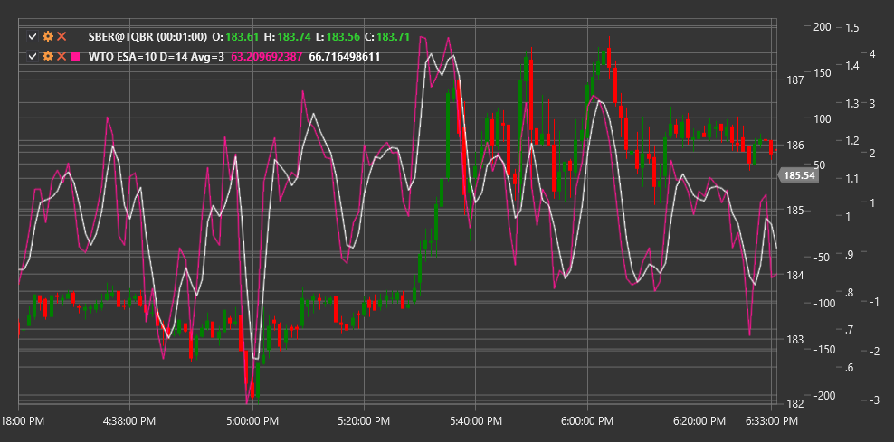

# WTO

**Wave Trend Oscillator (WTO)** is a technical indicator developed to identify overbought and oversold market levels, as well as to detect cyclical price fluctuations. WTO combines elements of channels and oscillators, making it an effective tool for identifying market momentum and potential reversal points.

To use the indicator, you need to use the [WaveTrendOscillator](xref:StockSharp.Algo.Indicators.WaveTrendOscillator) class.

## Description

Wave Trend Oscillator is designed to filter market noise and highlight primary price movements. The indicator oscillates around the zero line, creating wave patterns that correlate with cyclical price movements.

Key characteristics of WTO:
- Oscillations around the zero line, where positive values indicate an upward trend and negative values indicate a downward trend
- Overbought levels (usually above +60) and oversold levels (usually below -60)
- Ability to filter price noise and highlight primary movements

Key indicator signals:
- Zero line crossing (trend direction change)
- Exiting overbought/oversold zones
- Divergences between WTO and price (potential reversals)
- Specific wave patterns

## Parameters

- **EsaPeriod** - EMA period for calculating ESA value (typically 10)
- **DPeriod** - period for calculating deviation (typically 21)
- **AveragePeriod** - period for calculating the average of the final oscillator (typically 4)

## Calculation

Wave Trend Oscillator calculation involves several steps:

1. Calculate typical price:
   ```
   AP = (High + Low + Close) / 3
   ```

2. Create smoothed and absolute first measurement value:
   ```
   ESA = EMA(AP, EsaPeriod)
   D = EMA(Abs(AP - ESA), DPeriod)
   ```

3. Calculate the first oscillator line:
   ```
   CI = (AP - ESA) / (0.015 * D)
   ```

4. Smooth the oscillator to obtain the final WTO value:
   ```
   WTO = EMA(CI, AveragePeriod)
   ```

Typical values for the indicator parameters are: EsaPeriod = 10, DPeriod = 21, AveragePeriod = 4, but they can be adapted to different timeframes and instruments.



## See Also

[MACD](macd.md)
[Stochastic Oscillator](stochastic_oscillator.md)