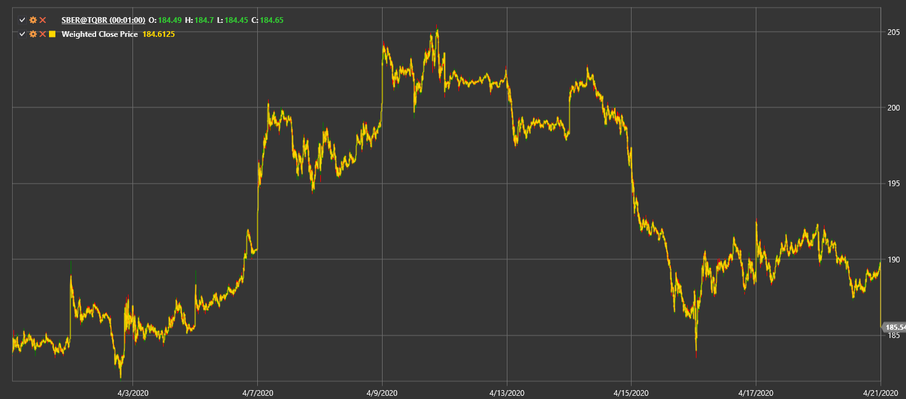

# Weighted Close Price

**Weighted Close Price (WCP)** is calculated as (High + Low + 2 × Close) / 4 for each candle.

To use the indicator, you must use the [WeightedClosePrice](xref:StockSharp.Algo.Indicators.WeightedClosePrice) class.

## Recommended content

[Typical Price](typical_price.md)
