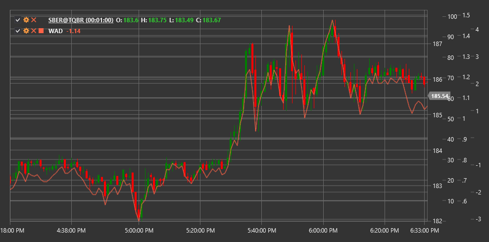

# WAD

**Williams Accumulation/Distribution (WAD)** is a volume indicator developed by Larry Williams. Unlike the traditional Accumulation/Distribution line, the WAD indicator focuses on the relationship between the closing price of the current period and the closing price of the previous period to determine buyer or seller pressure.

To use the indicator, you need to use the [WilliamsAccumulationDistribution](xref:StockSharp.Algo.Indicators.WilliamsAccumulationDistribution) class.

## Description

The Williams Accumulation/Distribution indicator is designed to identify discrepancies between price and volume that may signal potential trend reversals. WAD is particularly useful for revealing weakness in the current price movement.

Key features of WAD:
- Positive values indicate accumulation (buying pressure)
- Negative values indicate distribution (selling pressure)
- Divergences between WAD and price may precede price reversals

Main applications of the indicator:
- Confirming the current trend
- Identifying potential price reversals
- Determining buyer or seller pressure

## Calculation

The Williams Accumulation/Distribution indicator is calculated using the following logic:

1. Determine the True Range Protection (TRP) for the current period:
   ```
   TRP = Max(High - Low, |High - Close_prev|, |Low - Close_prev|)
   ```

2. Calculate the Accumulation/Distribution (AD) value for the current period:
   - If Close > Close_prev (market up):
      ```
      AD = Close - Min(Low, Close_prev) 
      ```
   - If Close < Close_prev (market down):
      ```
      AD = Close - Max(High, Close_prev)
      ```
   - If Close = Close_prev:
      ```
      AD = 0
      ```

3. Compute the WAD value by accumulating AD values:
   ```
   WAD = Previous WAD value + AD
   ```

The indicator accumulates positive and negative values, forming a cumulative line that can be used to compare with price movement.



## See Also

[ADL](accumulation_distribution_line.md)
[OBV](on_balance_volume.md)