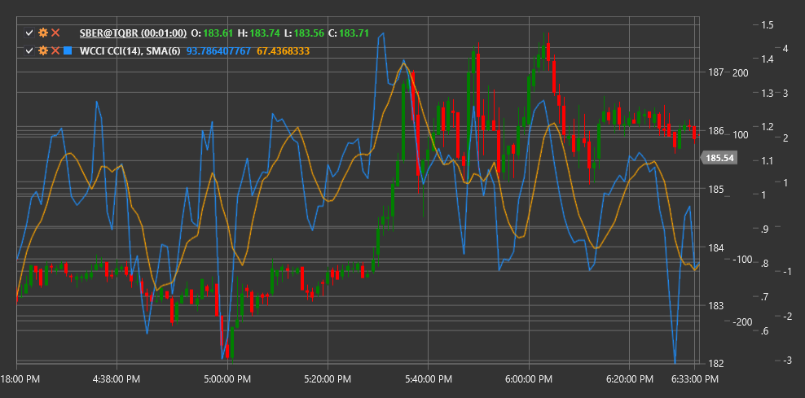

# WCCI

**Woodies CCI (WCCI)** is a modification of the standard Commodity Channel Index (CCI), developed by trader Ken Wood (known as "Woodies"). This CCI variation includes additional smoothing and is used as part of a comprehensive Woodies CCI trading system.

To use the indicator, you need to use the [WoodiesCCI](xref:StockSharp.Algo.Indicators.WoodiesCCI) class.

## Description

Woodies CCI is a modified version of the classic CCI indicator that includes two lines:
- The main CCI line with a selected period (typically 14)
- A smoothed CCI line, which is a simple moving average of the main CCI line

The Woodies CCI system uses these two lines, along with several key levels to generate trading signals. The main levels include:
- +100 and -100 (traditional overbought and oversold levels)
- +200 and -200 (strong overbought and oversold conditions)
- Zero line (important for trend determination)

Key signals in the Woodies CCI system:
- "Zero-line Reject" - when CCI approaches the zero line and then bounces off it, continuing in the previous direction
- "Trend-line Break" - when CCI breaks a significant trend line
- "Reverse Divergence" - a specific type of divergence between price and CCI

## Parameters

- **Length** - calculation period for the main CCI line (typically 14)
- **SMALength** - period for smoothing the main CCI line to obtain the second line (typically 9)

## Calculation

Woodies CCI calculation is performed in several steps:

1. First, calculate the standard CCI:
   ```
   Typical Price (TP) = (High + Low + Close) / 3
   Average Value (SMA) = SMA(TP, Length)
   Mean Deviation (MD) = Sum(|TP - SMA|) / Length
   CCI = (TP - SMA) / (0.015 * MD)
   ```

2. Then calculate the smoothed CCI line:
   ```
   Smooth CCI = SMA(CCI, SMALength)
   ```

Woodies CCI uses a combination of these two lines to create trading signals. In the classic Woodies system, the crossing of these lines, their interaction with key levels, and various patterns form the basis for trading decisions.



## See Also

[CCI](cci.md)