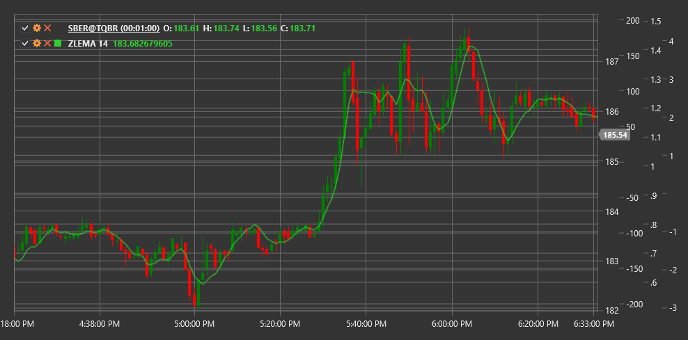

# ZLEMA

**Zero Lag Exponential Moving Average (ZLEMA)** is a modified version of the exponential moving average (EMA), developed by John Ehlers. ZLEMA is designed to eliminate or significantly reduce the lag inherent in traditional moving averages.

To use the indicator, you need to use the [ZeroLagExponentialMovingAverage](xref:StockSharp.Algo.Indicators.ZeroLagExponentialMovingAverage) class.

## Description

The Zero Lag Exponential Moving Average (ZLEMA) was created to solve the primary problem of most moving averages - signal lag. Traditional moving averages lag behind price movements due to the time window used for their calculation. ZLEMA minimizes this lag by using a correction mechanism based on the difference between the current price and the price in the past.

Main advantages of ZLEMA:
- Faster reaction to price changes
- Less lag compared to traditional moving averages
- Preservation of the smoothing effect characteristic of EMA

ZLEMA can be used for:
- Determining trend direction
- Finding entry and exit points
- Identifying support and resistance levels
- Creating trading systems based on crossovers

## Parameters

- **Length** - calculation period that determines the degree of smoothing (similar to the period in EMA).

## Calculation

ZLEMA calculation is based on eliminating lag through forecasting and includes the following steps:

1. Calculate lag as half the period:
   ```
   lag = (Length - 1) / 2
   ```

2. Compute the "detrended" price:
   ```
   detrendedPrice = 2 * Price - Price[lag]
   ```
   This is a key step that allows "looking ahead" and eliminating lag.

3. Apply exponential smoothing to the detrended price:
   ```
   k = 2 / (Length + 1)
   ZLEMA = k * detrendedPrice + (1 - k) * ZLEMA[previous]
   ```

The result is a moving average that follows the price much closer than an ordinary EMA with the same period while maintaining the smoothing effect.



## See Also

[EMA](ema.md)
[DEMA](dema.md)
[TEMA](tema.md)
[T3MA](t3_moving_average.md)