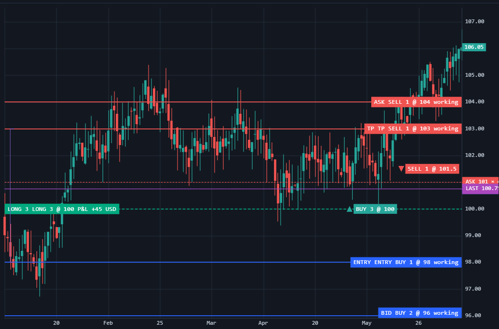

# Trading from the chart

`TradingLayer` is the broker-agnostic trading-state layer of the chart: it keeps normalized orders, positions, executions, and the quote, and hands user actions out as intents (`TradingIntent`). The layer sends nothing itself — it has no transport, no account, and no retries; the connection to the broker stays with the host.



## Wiring in

The layer ships as a separate entry point of the [@stocksharp/chart](https://www.npmjs.com/package/@stocksharp/chart) package:

```ts
import { TradingLayer, TradingLayerPrimitive } from '@stocksharp/chart/trading';
```

Without a bundler the same classes are available in the global `SSChart` object (`new SSChart.TradingLayer({ tickSize: 0.25 })`).

## Creating and updating

The layer is created with the price grid parameters, the `TradingLayerPrimitive` primitive draws its state over the series, and `TradingOrderPlacementAdapter` turns a click on the chart into an intent to place an order:

```ts
import { createChart, CandlestickSeries } from '@stocksharp/chart';
import {
  TradingLayer,
  TradingLayerPrimitive,
  TradingOrderPlacementAdapter,
  type TradingIntent,
} from '@stocksharp/chart/trading';

declare const broker: { send(intent: TradingIntent): Promise<void> };

const chart = createChart(document.querySelector<HTMLElement>('#chart')!, {
  timeScale: { timeVisible: true },
});
const candles = chart.addSeries(CandlestickSeries, { upColor: '#26a69a', downColor: '#ef5350' });

const layer = new TradingLayer({ tickSize: 0.25 });

chart.attachPrimitive(new TradingLayerPrimitive(layer, { showInactiveOrders: false }), {
  series: candles,
});

// The canonical broker state: the chart only displays it and never changes it itself.
layer.setOrders([{
  id: 'ob1',
  side: 'buy',
  type: 'limit',
  status: 'working',
  timeInForce: 'good-till-cancelled',
  quantity: 2,
  filledQuantity: 0,
  price: 96,
  revision: 1,
  permissions: { canModify: true, canCancel: true },
  label: 'BID',
}]);

layer.setPositions([{
  id: 'pos1',
  side: 'long',
  quantity: 3,
  averagePrice: 100,
  revision: 1,
  pnl: { realized: 0, unrealized: 45, currency: 'USD', markPrice: 101.5 },
  permissions: { canClose: true, canReverse: true, canProtect: true },
}]);

layer.setQuote({ time: 1704326400, bidPrice: 100.75, bidSize: 5, askPrice: 101, askSize: 4 });

// Intents go out to the host, and the host answers the layer with the result.
layer.subscribeIntents(intent => {
  broker.send(intent).then(
    () => layer.resolveIntent({ intentId: intent.intentId, status: 'accepted' }),
    (error: Error) => layer.resolveIntent({
      intentId: intent.intentId,
      status: 'rejected',
      reason: error.message,
    }),
  );
});

// Ctrl + left button is a limit buy, Ctrl + right button is a limit sell.
new TradingOrderPlacementAdapter(chart, layer, { quantity: 1, orderType: 'limit', modifier: 'ctrl' });
```

`setOrders`, `setPositions`, `setExecutions`, and `setQuote` replace the corresponding collection as a whole. Every call is normalized and compared against the current state: when nothing has changed, the subscribers are not called, and otherwise a change is published with the `added`, `updated` (`previous` / `current` pairs), `removed`, and `orderChanged` fields. The quote is the exception: its change carries only `previous` and `current`. The current snapshot is given out by `state()` — that is `{ version, orders, positions, executions, quote }`.

Normalization is strict: prices must fall on the `tickSize` grid (with the `priceOrigin` offset), and quantities on `quantityStep` when it is set; a limit order requires `price`, a stop order `stopPrice`, and a stop-limit order both fields. Inconsistent data is rejected with an exception rather than quietly corrected.

## Intents

The layer does not carry out user actions but publishes them as an intent: a `request*` method returns an intent object, puts it into the pending queue, and hands it to the `subscribeIntents` subscribers. The host carries the intent out at the broker and closes it with a `resolveIntent({ intentId, status, reason })` call with the `accepted` or `rejected` status — the outcome arrives at `subscribeIntentOutcomes` together with the original intent. Pending intents are listed by `pendingIntents()`.

Permissions are checked before publication: modifying an order requires `permissions.canModify`, cancelling it `canCancel`, and position actions `canClose`, `canReverse`, and `canProtect`. An order without permissions counts as read-only, and the call throws. The `expectedRevision` of the canonical entity is put into the intent so that the broker can reject a request built on stale data.

## Drawing and dragging

`TradingLayerPrimitive` is a chart primitive that subscribes to the layer when attached and draws the order lines with their labels, the position line with its P&L, execution markers, the bid/ask/last lines, and the bracket links. What to show and in which colors is set by the constructor options and `applyOptions`: `showOrders`, `showInactiveOrders`, `showPositions`, `showExecutions`, `showExecutionLabels`, `showQuote`, `showPnl`, `showBrackets`, `autoscale`, the set of colors (`orderBuyColor`, `orderSellColor`, `inactiveOrderColor`, `longPositionColor`, `shortPositionColor`, `executionBuyColor`, `executionSellColor`, `bidColor`, `askColor`, `lastColor`, `bracketColor`), `lineWidth`, `fontSize`, `orderLabelSpacing`, `zOrder`, and the `priceFormatter`, `quantityFormatter`, and `pnlFormatter` formatters. The `id` is set once at creation and does not change afterwards.

An order line can be dragged with the mouse when the order is active (`pending`, `working`, or `partially-filled`), is not a market order, and carries the `canModify` permission. While the drag is in progress the primitive shows a preview price snapped to the grid; on button release a `requestModifyOrder` intent is published, and the preview holds until the host closes the intent — a rejected one returns the line to the canonical price.

Cursor hits are described by `TradingOrderHitData`, `TradingPositionHitData`, `TradingExecutionHitData`, and `TradingQuoteHitData`; `isTradingPrimitiveHitData(value)` helps recognize them in a handler.

## Placing orders with the mouse

`TradingOrderPlacementAdapter` connects the chart's own placement signal to the layer: it turns the placement mode on, listens to the clicks, and calls `requestPlaceOrder`. It creates no price lines itself and does not talk to the broker.

The options: `quantity` (mandatory), `orderType` — `'limit'` or `'stop'` (`'limit'` by default), `timeInForce` (`'good-till-cancelled'` by default), `modifier` — `'ctrl'`, `'shift'`, or `'alt'` (`'ctrl'` by default), `color`, `title`, `enabled`, and `sideResolver`. The default resolver gives a buy on the left button and a sell on the right one, and `null` cancels the placement. The adapter is driven by the `options()`, `applyOptions(patch)`, `setEnabled(enabled)`, and `dispose()` methods.

## Public methods of the layer

- `setOrders(orders)`, `setPositions(positions)`, `setExecutions(executions)`, `setQuote(quote)` — replace the canonical state; `setQuote(null)` removes the quote.
- `state()` — the current state snapshot with the version number.
- `normalizationOptions()` — the price grid parameters the layer was created with.
- `subscribeChanges(handler)`, `subscribeIntents(handler)`, `subscribeIntentOutcomes(handler)` — subscriptions; each returns an unsubscribe function.
- `pendingIntents()`, `resolveIntent(resolution)` — the pending intent queue and its closing.
- `requestPlaceOrder(order)`, `requestModifyOrder(orderId, changes)`, `requestCancelOrder(orderId)` — working with orders.
- `requestClosePosition(positionId, quantity)`, `requestReversePosition(positionId, quantity)` — working with the position; without a quantity the whole position is taken.
- `requestCreateStopLoss`, `requestEditStopLoss`, `requestRemoveStopLoss`, `requestCreateTakeProfit`, `requestEditTakeProfit`, `requestRemoveTakeProfit` — the protective orders of a bracket.
- `dispose()` — release resources.

## Other exports

- The model enumerations: `TradingSide`, `ChartOrderType`, `ChartOrderStatus`, `ChartOrderTimeInForce`, `ChartPositionSide`, `ChartBracketRole`, `ChartExecutionLiquidity`, `TradingIntentKind`.
- The layer and primitive enumerations: `TradingLayerChangeKind`, `TradingIntentOutcomeStatus`, `TradingPrimitiveEntityKind`, `TradingQuoteKind`.
- Data validation and normalization: `normalizeChartOrder`, `normalizeChartOrders`, `normalizeChartPosition`, `normalizeChartPositions`, `normalizeChartExecution`, `normalizeChartExecutions`, `normalizeChartQuote`, `normalizeChartOrderRequest`, `normalizeTradingIntent`, `normalizeTradingModelOptions`.
- Helper computations: `quantizeTradingPrice` — snapping an arbitrary price to the grid, `chartOrderRemainingQuantity` — the unfilled remainder of an order, `chartPnlTotal` — the sum of realized and unrealized P&L.
- The `ChartOrder`, `ChartPosition`, `ChartExecution`, `ChartQuote`, `ChartOrderRequest`, `ChartOrderModification`, `TradingIntent` types and the intent interfaces derived from them.

## See also

- [JavaScript charts](../charts.md)
- [Candlestick](candlestick.md)
- [History backfill](backfill.md)
