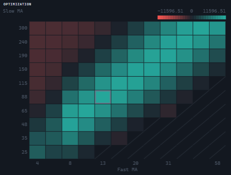

# Optimization heatmap

`OptimizationHeatmapWidget` draws one metric over two parameters: the values of the first parameter run horizontally, those of the second vertically, and at the intersection lies a cell colored by what that pair of parameters produced. The control knows nothing about the optimization itself — a map of a metric over two axes looks the same however the pairs were computed — so the pairs are supplied by the host together with the axis and metric captions.



## Creating and updating

```ts
import {
  HeatDirections,
  OptimizationHeatmapWidget,
  type HeatCell,
  type TradingHost,
} from '@stocksharp/trading-controls';

declare const host: TradingHost;

const heatmap = OptimizationHeatmapWidget.create(
  document.querySelector<HTMLElement>('#heatmap')!,
  {},
  { host },
);

const cells: HeatCell[] = [
  { x: '10', y: '00:05:00', value: 12_400 },
  { x: '10', y: '00:15:00', value: 9_150 },
  { x: '20', y: '00:05:00', value: -1_800 },
  { x: '20', y: '00:15:00', value: 15_900 },
];

heatmap.update({
  xLabel: 'Length',
  yLabel: 'Timeframe',
  metricLabel: 'Net profit',
  betterWhen: HeatDirections.Higher,
  cells,
});
```

The only dependency is `host`; the `OptimizationHeatmapDeps` interface holds no other fields. The map takes no handlers: a cell is an average over the runs of one pair, not a run, so there is nothing to open on a click. The second argument of `create` is the saved instance state; the control neither reads it nor writes anything into it.

`update` replaces the map as a whole: a pair that dropped out of the set has ceased to exist, and a cell left over from it would report a run that is no longer in the report.

The argument of `update` is a `HeatmapData` object with the fields:

| Field | Purpose |
|---|---|
| `xLabel` | Name of the horizontal axis, captioned under the map. |
| `yLabel` | Name of the vertical axis, captioned above the map. |
| `metricLabel` | Name of the metric, shown in the panel header. |
| `betterWhen` | Which way is better: `HeatDirections.Higher` (`'higher'`) or `HeatDirections.Lower` (`'lower'`). The field is mandatory — without it a drawdown map would paint the worst corner in the color of victory. |
| `cells` | The `HeatCell` measurements: `x` and `y` are the axis values as strings, `value` is a number. |

The `HeatmapData` type is declared in the control's module, and the package root export does not re-export it: for explicit typing, import it from the `@stocksharp/trading-controls/optimization-heatmap-widget` subpath.

The static `OptimizationHeatmapWidget.TYPE` property equals `ControlTypes.OptimizationHeatmap` — the `optimizationHeatmap` identifier.

## Data and presentation

The axes are discrete, so their values are passed as strings: `10`, `00:05:00`, and `True` are equally valid positions on an axis. The value order is numeric when every value is a number (otherwise `10` would come before `2` and the shape of the map would follow from how the numbers were written), and textual in all other cases; for fixed-width strings, such as the ones .NET writes time intervals with, the textual order matches the chronological one. The first grid row lies at the foot of the map: this is a chart, and the Y axis grows upwards.

Several runs on one pair collapse into a single cell — an average together with the number of runs; an entry with a non-numeric metric is dropped rather than spoiling the whole cell. The color is measured from a reference value: if the measurements cross zero, zero becomes the reference, otherwise the middle of the range does, because anchoring to a zero the sweep never reached would give one flat patch with no contrast. The span to full color is the same on both sides, so equal saturation anywhere means an equal deviation of the metric. The `betterWhen` direction is folded into the sign: the best result is always painted in the growth color.

The numbers are not printed inside the cells: in a forty-by-forty sweep digits in a cell are illegible, and reading the color is the point of the map. A pair nobody ran does not stay empty but is crossed out with a diagonal: an untested pair and a pair with a zero result are different facts, which a scale with zero at the neutral point would draw identically. The best cell is outlined with a border in the grid color — the only non-directional color of the palette.

Above the map a key is drawn from the same two colors with three captions: the lower edge, the reference value, and the upper edge. Axis captions are thinned out when the values stop fitting, but the outermost value of an axis is always captioned. Numbers are printed through `formatStatistic` — the same format as in the statistics panel: rounding to two decimals.

Hovering over a measured cell brings up a tooltip with the value of both axes and of the metric. The number of runs is added to it only when more than one run was averaged, and the `Best` mark only on the best cell. There is no tooltip over a crossed-out cell: it is already visible as untested. The tooltip is kept inside the canvas bounds so that it does not run off the edge at the outermost cells.

While there is not a single measurement, a placeholder with the text under the `NoOptimizationResults` key is shown instead of the map.

## What the control does and what is left to the host

The control builds the panel markup itself, fits the canvas to the container through `ResizeObserver`, and allocates the buffer in physical pixels according to `devicePixelRatio`, otherwise the map would be drawn with a grid of hairlines. It requests the colors and the font from `host.presentation.canvasPalette()` on every drawing: `up` and `down` are the two sides of the scale, `grid` is the grid, the crossings-out, the border of the best cell and the captions, and `font` is the font of the text on the canvas. The package picks no palette of its own here, so a theme change at the host redraws the map in the new colors. Transparency is the only thing the map itself disposes of.

The panel close button calls `host.close()`, the instance registers itself through `host.register` and unregisters in `dispose`. All visible text is requested through `host.t`: `OptimizationHeatmap`, `OptimizationHeatmapChart`, `ClosePanel`, `NoOptimizationResults`, `Runs`, `Best`. The control keeps no settings of its own in `host.preferences` and has no keys there.

The host supplies the data: the map does not start the sweep, does not choose or compute the metric, and does not guess the "better" direction — what is passed to `update` is what gets drawn.

## Public methods

- `update(data)` — show the map as a whole.
- `dispose()` — disconnect the size observer, call `host.unregister`, and remove the root element.

## Helper functions

All the geometry of the map is moved to a separate module and exported by the package — it can be used without the control:

- `layoutHeatmap(input)` — the layout of the map: grid, gaps, captions, key, and scale; `null` when there are no measurements.
- `hitHeatmap(layout, x, y)` — the cell under a point, or `null`.
- `heatScale(buckets)` — the reference value, the span, and the range bounds.
- `tintOf(value, scale, betterWhen)` — the saturation from −1 to 1, where positive always means better.
- `valueAt(tint, scale, betterWhen)` — the inverse transform, for the key captions.
- `HeatDirections` — the `Higher` and `Lower` directions.

## See also

- [JavaScript Trading Controls](../trading_controls.md)
- [Optimization surface](optimization_surface.md)
- [Statistics](statistics.md)
- [Equity curve](equity.md)
