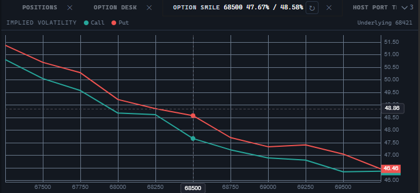

# Volatility smile

`OptionSmileWidget` draws the volatility smile of one option series: the implied volatility of calls and puts by strike, two lines on one scale. The chart is built by the engine from the `@stocksharp/chart` package, declared as a peer dependency.



## Creating and updating

```ts
import {
  OptionSmileWidget,
  type OptionStrike,
  type TradingHost,
} from '@stocksharp/trading-controls';

declare const host: TradingHost;

const smile = OptionSmileWidget.create(
  document.querySelector<HTMLElement>('#smile')!,
  {},
  { host },
);

const chain: OptionStrike[] = [
  { strike: 67_000, call: { ivLast: 0.52 }, put: { ivBid: 0.55, ivAsk: 0.57 } },
  { strike: 67_500, call: { ivLast: 0.48 }, put: { ivLast: 0.50 } },
  { strike: 68_000, call: { ivBid: 0.45, ivAsk: 0.47 }, put: { ivLast: 0.47 } },
  { strike: 69_000, call: { ivLast: 0.49 }, put: {} },
];

smile.update(chain, { assetPrice: 68_120 });
```

The only dependency is `host`; the `OptionSmileDeps` interface holds no other fields. The second argument of `create` is the saved instance state, which the smile neither reads nor writes to.

`update` replaces the whole chain at once. The second parameter, `context`, is optional and defaults to an empty object; it is passed with the same `OptionChainContext` type as the option desk uses, but the smile needs only the underlying price, `assetPrice`, from it.

The static `OptionSmileWidget.TYPE` property equals `ControlTypes.OptionSmile` — the `optionSmile` identifier.

## Data and presentation

Strikes are sorted ascending, and entries with a non-numeric `strike` are dropped. A side's volatility is taken from `ivLast`, or, if there were no trades, as the average of `ivBid` and `ivAsk`; only finite positive values count. When none of them exists, the point is not drawn: the strike stays on the axis and the line breaks — that is how a strike quoted by one side only becomes visible. Values are plotted as percentages.

The strike axis works in `ordinal` mode: the steps are even across the listing, not across the distance between the numbers, so the gap between 67_500 and 68_000 does not turn into a hole. The axis labels and the crosshair label are produced by the same price formatter.

The underlying price is not drawn as a line — there is no step for it on an ordinal axis — but is written as text in the legend next to the `Call` and `Put` keys. Hovering over the chart brings up a line with the strike and the values of both sides at it: a smile is read by the distance between the curves, so both are shown.

While no strike is quoted, a placeholder with the text under the `NoOptions` key is shown instead of the chart.

## What the control does and what is left to the host

The control creates the chart itself on the first data, takes the colors, the font, and the grid color from `host.presentation.canvasPalette()` (`up` is the call, `down` is the put), watches the container size through `ResizeObserver` and fits the canvas, and handles the zoom reset button and the panel close button, which calls `host.close()`. All visible text is requested through `host.t`: `OptionSmile`, `ResetView`, `ClosePanel`, `ImpliedVolatility`, `Call`, `Put`, `OptionChain`, `NoOptions`, `Underlying`.

The host supplies the data: the smile takes out no market subscriptions, computes no volatility, and does not tell one series from another — what is passed to `update` is what gets drawn. The control keeps no settings of its own in `host.preferences` and has no keys there.

## Public methods

- `update(strikes, context)` — show the chain and the context it was taken in.
- `resetZoom()` — return to the view of the whole chain after zooming.
- `chart()` — return the chart object (`IChartApi`), or `null` if the chart has not been created yet; needed by a host that adds a second series or a marker to the same canvas.
- `dispose()` — disconnect the size observer, remove the chart, call `host.unregister`, and remove the root element.

## Helper functions

The package also exports the functions the drawing is built on — they can be used on their own:

- `sideVolatility(side)` — the volatility of a side, or `null` when it is unknown.
- `sortedChain(strikes)` — the chain in drawing order: by ascending strike, without invalid entries.
- `toSmileSeries(chain, put)` — one side as a set of chart points.

## See also

- [JavaScript Trading Controls](../trading_controls.md)
- [Option desk](option_desk.md)
- [Equity curve](equity.md)
- [Order book](order_book.md)
