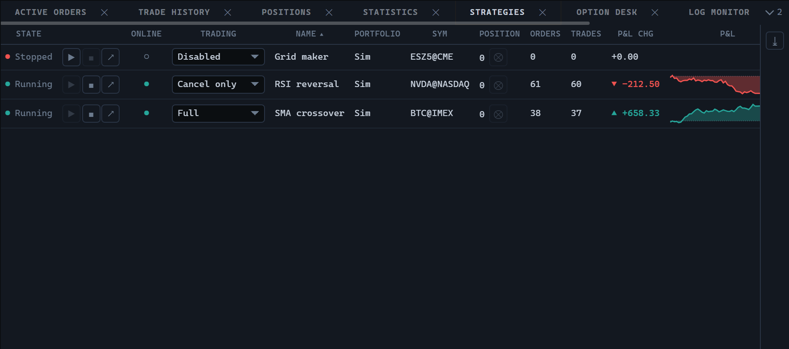

# Strategies

`StrategiesWidget` shows the list of running strategies: one row per strategy with its state, trading mode, position, order and trade counters, profit, and control buttons. The control identifier is `strategies` (`ControlTypes.Strategies`), also available through the static `StrategiesWidget.TYPE` property.



## Creating and updating

```ts
import {
  StrategiesWidget,
  StrategyStates,
  type TradingHost,
} from '@stocksharp/trading-controls';

declare const host: TradingHost;

let strategies!: StrategiesWidget;

strategies = StrategiesWidget.create(
  document.querySelector<HTMLElement>('#strategies')!,
  {},
  {
    host,
    tradingModes: ['Disabled', 'CancelOrders', 'ReducePosition', 'Full'],
    start: id => console.log('start', id),
    stop: id => console.log('stop', id),
    closePosition: id => console.log('flatten', id),
    openStrategy: id => console.log('open', id),
    riskRules: id => console.log('risk', id),
    setTradingMode: (id, mode) => console.log('mode', id, mode),
  },
);

strategies.update([{
  id: 'sma-1',
  name: 'SMA crossover',
  state: StrategyStates.Started,
  online: true,
  tradingMode: 'Full',
  portfolio: 'Demo',
  security: 'BTC@IMEX',
  position: 0.25,
  ordersCount: 12,
  tradesCount: 8,
  pnlChange: 105,
  realized: 20,
  unrealized: 85,
  pnl: [
    { time: 1, value: 0 },
    { time: 2, value: 60 },
    { time: 3, value: 105 },
  ],
}]);
```

`update` takes the full set of rows and replaces the table with it: a strategy missing from the list is treated as deleted, and its row disappears. There is no streaming update of a single row — the new state arrives as a whole list.

The second argument of `create` is the saved instance state. The control neither reads it nor saves anything itself: no keys in `host.preferences`, no `host.persistState` calls.

The `StrategyStates` object exports the `Stopped`, `Starting`, `Started`, and `Stopping` states.

## Dependencies

Only the host is mandatory. Host completeness is checked on creation by the `assertHost` function, so an incomplete `TradingHost` raises an exception naming the missing member rather than producing a button that does nothing.

| Dependency | Required | Default behaviour |
|---|---|---|
| `host` | mandatory | — |
| `start(id)` | optional | No start button is created. |
| `stop(id)` | optional | No stop button is created. |
| `closePosition(id)` | optional | The position column shows the number only. |
| `openStrategy(id)` | optional | No button for opening the strategy is created. |
| `riskRules(id)` | optional | No risk rules button is created. |
| `setTradingMode(id, mode)` | optional | The trading mode is shown as text. |
| `tradingModes` | optional | An empty list; no mode drop-down is created. |

This set makes a read-only panel possible: if no action function is passed, the table displays the data and shows no buttons at all.

The `tradingModes` strings go through `host.t`, that is, they serve as translation keys. They belong to the host rather than the package, so their absence from `translation-keys.json` is expected, and the host translates them.

## States and actions

The state cell consists of a dot and a word: the dot is read when scanning the list quickly, while the word tells `Starting` from `Started`. When the row's `error` field is filled, the error text appears in the tooltip of both the dot and the word, and a strategy stopped by a failure is labelled "Error" rather than "Stopped".

Row buttons are created only for the functions supplied by the host, and are enabled only where the state allows it:

- start — only for a strategy in the `Stopped` state;
- stop — only for a strategy in the `Started` state;
- close position — only for a running strategy with a non-zero position;
- risk rules and opening the strategy — always.

The trading mode drop-down is enabled only for a stopped strategy: the mode decides what the strategy will be started with and is not a lever to pull while trading. Changing the mode calls `setTradingMode`; the control does not change the value in the row itself and waits for the next `update`.

## Columns and presentation

The table shows state, actions, the online flag, trading mode, name, portfolio, security, position, order and trade counts, profit change, the profit chart, realized and unrealized profit, and the error. The online flag is a combined one: a strategy counts as online only if it is both formed and connected, and that is decided by the data provider.

The color classes for the position, the profit change, and both profit values are returned by `host.presentation.pnlClass`. The profit change is additionally marked with a direction arrow; a zero change carries no arrow.

The chart column draws the cumulative profit curve over the `pnl` points in a 140 × 26 CSS pixel field. The canvas is created with `devicePixelRatio` in mind, so the line stays crisp on high-density screens. The colors come from `host.presentation.canvasPalette()`, and the curve is colored by the outcome of the run: a strategy that reached a peak and gave it all back is shown as losing. Without `pnl` points the cell stays empty.

The default sorting is by name, ascending: the list is read top to bottom looking for a particular strategy, and rows reshuffling after the profit gets in the way of that reading. The panel also supports multiple row selection, a context menu, filters, and exporting to XLSX.

## What is left to the host

The control does not start or stop strategies, does not send orders, and does not close positions — it calls the functions it was given and waits for a new list of rows.

The control takes `pnlChange` as it is: the reference point is chosen by the data provider. That way a restarted strategy does not keep measuring the change from before the restart.

The panel close button calls `host.close()`, and the export writes out a `strategies` file. The instance registers itself with the host on creation and unregisters in `dispose`.

## Public methods

- `StrategiesWidget.create(hostEl, state, deps)` — build the panel and add it to the container.
- `update(rows)` — replace the whole strategy list.
- `dispose()` — unregister, remove the table, and release resources.

## See also

- [JavaScript Trading Controls](../trading_controls.md)
- [Positions](positions.md)
- [Active orders](active_orders.md)
- [Trade history](trade_history.md)
