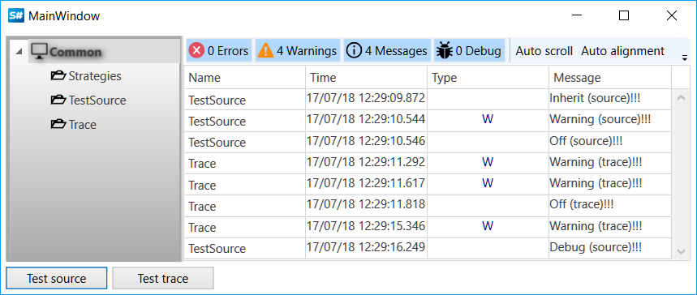

# Other logs sources

In previous topics objects of embedded in the [S\#](../../api.md) classes were sources of logs. The [S\#](../../api.md) provides possibilities for the cases when the source of the logs is your own class, or source does not have to be associated with a particular class, but it serve the entire application. For the first case you must implement in your class the [ILogSource](xref:StockSharp.Logging.ILogSource) interface or inherit it from the [BaseLogReceiver](xref:StockSharp.Logging.BaseLogReceiver). In the second situation, you can use the [TraceSource](xref:StockSharp.Logging.TraceSource), that using the tracing system .NET. How to do this is shown in the *Samples\/Common\/SampleLogging* sample. 

## SampleLogging sample

1. Create a custom class that inherits from the [BaseLogReceiver](xref:StockSharp.Logging.BaseLogReceiver).

   ```cs
   private class TestSource : BaseLogReceiver
   {
   }
   ```
2. Create the [LogManager](xref:StockSharp.Logging.LogManager) and declare a variable of the user class.

   ```cs
   private readonly LogManager _logManager = new LogManager();
   private readonly TestSource _testSource;
   				
   ```
3. Add log sources.

   ```cs
   _logManager.Sources.Add(_testSource = new TestSource());
   _logManager.Sources.Add(new StockSharp.Logging.TraceSource());
   				
   ```
4. Add log listeners.

   ```cs
   // log messages will be displayed in GUI component
   _logManager.Listeners.Add(new GuiLogListener(Monitor));
   // also writing in files
   _logManager.Listeners.Add(new FileLogListener
   {
   	FileName = "logs",
   });
   				
   ```
5. Add messages of the custom class logging. The level of logging is chosen randomly.

   ```cs
   var level = RandomGen.GetEnum<LogLevels>();
   switch (level)
   {
   	case LogLevels.Inherit:
   	case LogLevels.Debug:
   	case LogLevels.Info:
   	case LogLevels.Off:
   		_testSource.AddInfoLog("{0} (source)!!!".Put(level));
   		break;
   	case LogLevels.Warning:
   		_testSource.AddWarningLog("Warning (source)!!!");
   		break;
   	case LogLevels.Error:
   		_testSource.AddErrorLog("Error (source)!!!");
   		break;
   	default:
   		throw new ArgumentOutOfRangeException();
   }
   ```
6. Add tracing messages.

   ```cs
   var level = RandomGen.GetEnum<LogLevels>();
   switch (level)
   {
   	case LogLevels.Inherit:
   	case LogLevels.Debug:
   	case LogLevels.Info:
   	case LogLevels.Off:
   		Trace.TraceInformation("{0} (trace)!!!".Put(level));
   		break;
   	case LogLevels.Warning:
   		Trace.TraceWarning("Warning (trace)!!!");
   		break;
   	case LogLevels.Error:
   		Trace.TraceError("Error (trace)!!!");
   		break;
   	default:
   		throw new ArgumentOutOfRangeException();
   }
   ```
7. The result of example work.
