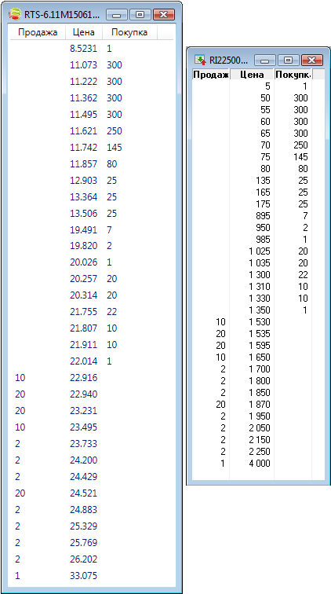

# Volatility trading

For option quoting, a special [VolatilityQuotingStrategy](xref:StockSharp.Algo.Strategies.Derivatives.VolatilityQuotingStrategy) strategy is implemented, which provides volume quoting within the specified range of volatility.

## Quoting by volatility

1. The [S\#](../../api.md) installation package includes the example SampleOptionQuoting, which quotes the selected strike within the specified range of volatility.
2. Creating a connection to the [OpenECry](../connectors/stock_market/openecry.md) and starting the export:

   ```cs
   private void InitConnector()
   {
   	// subscribe on connection successfully event
   	Connector.Connected += () =>
   	{
   		// update gui labels
   		this.GuiAsync(() => ChangeConnectStatus(true));
   	};
   	// subscribe on disconnection event
   	Connector.Disconnected += () =>
   	{
   		// update gui labels
   		this.GuiAsync(() => ChangeConnectStatus(false));
   	};
   	// subscribe on connection error event
   	Connector.ConnectionError += error => this.GuiAsync(() =>
   	{
   		// update gui labels
   		ChangeConnectStatus(false);
   		MessageBox.Show(this, error.ToString(), LocalizedStrings.ErrorConnection);
   	});
   	// fill underlying asset's list
   	Connector.NewSecurity += security =>
   	{
   		if (security.Type == SecurityTypes.Future)
   			_assets.Add(security);
   	};
   	Connector.SecurityChanged += security =>
   	{
   		if (_model.UnderlyingAsset == security || _model.UnderlyingAsset.Id == security.UnderlyingSecurityId)
   			_isDirty = true;
   	};
   	// subscribing on tick prices and updating asset price
   	Connector.NewTrade += trade =>
   	{
   		if (_model.UnderlyingAsset == trade.Security || _model.UnderlyingAsset.Id == trade.Security.UnderlyingSecurityId)
   			_isDirty = true;
   	};
   	Connector.NewPosition += position => this.GuiAsync(() =>
   	{
   		var asset = SelectedAsset;
   		if (asset == null)
   			return;
   		var assetPos = position.Security == asset;
   		var newPos = position.Security.UnderlyingSecurityId == asset.Id;
   		if (!assetPos && !newPos)
   			return;
   		if (assetPos)
   			PosChart.AssetPosition = position;
   		if (newPos)
   			PosChart.Positions.Add(position);
   		RefreshChart();
   	});
   	Connector.PositionChanged += position => this.GuiAsync(() =>
   	{
   		if ((PosChart.AssetPosition != null && PosChart.AssetPosition == position) || PosChart.Positions.Cache.Contains(position))
   			RefreshChart();
   	});
   	try
   	{
   		if (File.Exists(_settingsFile))
   			Connector.Load(new JsonSerializer<SettingsStorage>().Deserialize(_settingsFile));
   	}
   	catch
   	{
   	}
   }
   private void ConnectClick(object sender, RoutedEventArgs e)
   {
   	if (!_isConnected)
   	{
   		ConnectBtn.IsEnabled = false;
   		_model.Clear();
   		_model.MarketDataProvider = Connector;
   		ClearSmiles();
   		PosChart.Positions.Clear();
   		PosChart.AssetPosition = null;
   		PosChart.Refresh(1, 1, default(DateTimeOffset), default(DateTimeOffset));
   		Portfolio.Portfolios = new PortfolioDataSource(Connector);
   		PosChart.MarketDataProvider = Connector;
   		PosChart.SecurityProvider = Connector;
   		Connector.Connect();
   	}
   	else
   		Connector.Disconnect();
   }            		
   	  				
   ```

3. Set up the [VolatilityQuotingStrategy](xref:StockSharp.Algo.Strategies.Derivatives.VolatilityQuotingStrategy) strategy (filling the range of volatility, as well as the creation of the order, wherethrough the required volume and quoting direction are specified): 

   ```none
   private void StartClick(object sender, RoutedEventArgs e)
   {
   	var option = SelectedOption;
   	// create DOM window
   	var wnd = new QuotesWindow { Title = option.Name };
   	wnd.Init(option);
   	// create delta hedge strategy
   	var hedge = new DeltaHedgeStrategy
   	{
   		Security = option.GetUnderlyingAsset(Connector),
   		Portfolio = Portfolio.SelectedPortfolio,
   		Connector = Connector,
   	};
   	// create option quoting for 20 contracts
   	var quoting = new VolatilityQuotingStrategy(Sides.Buy, 20,
   			new Range<decimal>(ImpliedVolatilityMin.Value ?? 0, ImpliedVolatilityMax.Value ?? 100))
   	{
   		// working size is 1 contract
   		Volume = 1,
   		Security = option,
   		Portfolio = Portfolio.SelectedPortfolio,
   		Connector = Connector,
   	};
        // link quoting and hedging
   	hedge.ChildStrategies.Add(quoting);
        // start hedging
   	hedge.Start();
   	wnd.Closed += (s1, e1) =>
   	{
   		// force close all strategies while the DOM was closed
   		hedge.Stop();
   	};
   	// show DOM
   	wnd.Show();
   }
   ```

4. Starting quoting:

   ```cs
   hedge.Start();
   ```

5. For a visual presentation of the volatility the example shows how you can convert the standard order book with quotations to the order book of volatility through the use of the [DerivativesHelper.ImpliedVolatility](xref:StockSharp.Algo.Derivatives.DerivativesHelper.ImpliedVolatility(StockSharp.Messages.IOrderBookMessage,StockSharp.BusinessEntities.ISecurityProvider,StockSharp.BusinessEntities.IMarketDataProvider,StockSharp.BusinessEntities.IExchangeInfoProvider,System.DateTimeOffset,System.Decimal,System.Decimal))**(**[StockSharp.Messages.IOrderBookMessage](xref:StockSharp.Messages.IOrderBookMessage) depth, [StockSharp.BusinessEntities.ISecurityProvider](xref:StockSharp.BusinessEntities.ISecurityProvider) securityProvider, [StockSharp.BusinessEntities.IMarketDataProvider](xref:StockSharp.BusinessEntities.IMarketDataProvider) dataProvider, [StockSharp.BusinessEntities.IExchangeInfoProvider](xref:StockSharp.BusinessEntities.IExchangeInfoProvider) exchangeInfoProvider, [System.DateTimeOffset](xref:System.DateTimeOffset) currentTime, [System.Decimal](xref:System.Decimal) riskFree, [System.Decimal](xref:System.Decimal) dividend **)** method: 

   ```cs
   private void OnQuotesChanged()
   {
       DepthCtrl.UpdateDepth(_depth.ImpliedVolatility(Connector, Connector, Connector.CurrentTime));
   }
   ```

   

6. Ending quoting and stopping the strategy:

   ```none
   hedge.Stop();
   ```

## Recommended content

[Delta hedging](delta_hedging.md)
