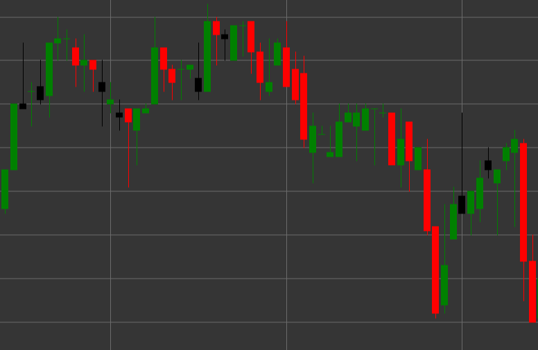

# Pattern Bearish Candle

Bearish Candle is a candlestick pattern characterized by a closing price lower than the opening price. This pattern shows a bearish market sentiment.

##### Key Features:

- Opening price is higher than closing price (O > C).
- Indicates bearish pressure in the market.

### Interpretation

The Bearish Candle signals a bearish market sentiment with several characteristics:

- A long upper shadow indicates that buyers tried to push the price up, but sellers took control.
- Closing below the opening shows the predominance of sellers at the end of the period.
- The ratio between the candle body and the upper shadow demonstrates the strength of sellers after testing upper levels.
- In an uptrend, it may signal a potential reversal or correction.
- In a downtrend, it confirms the strength of the trend, especially after a rebound.

### Trading Strategies

Bearish Candle can be used in various trading strategies:

- Enter a short position after the formation of a Bearish Candle at a resistance level or in an overbought zone.
- Set a stop-loss above the maximum of the candle to protect against further rise.
- Combine with other technical indicators or patterns to increase the probability of a successful trade.
- Use to confirm downtrend signals from indicators such as MACD or Moving Averages.
- Pay attention to trading volume - high volume enhances the significance of the signal.
- Possible use for closing long positions or partial profit-taking when this pattern appears within an uptrend.

## See also

[Pattern Bullish Candle](bullish.md)

[Pattern Black Candle](black_candle.md)