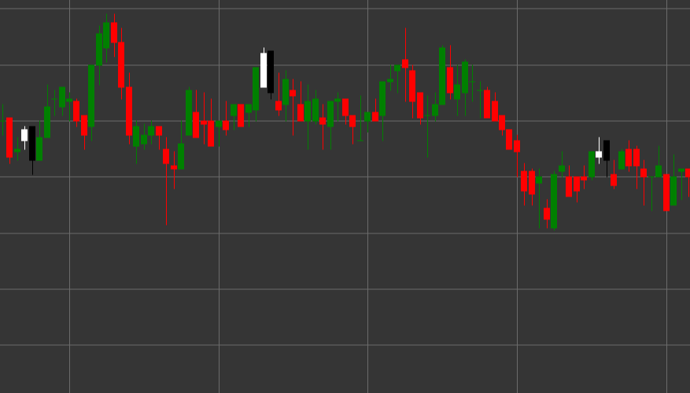

# Pattern Bearish Engulfing

Bearish Engulfing is a powerful bearish reversal candlestick pattern consisting of two candles that forms in an uptrend. The first candle is white (bullish), followed by a black (bearish) candle, the body of which completely engulfs (covers) the body of the previous candle.

##### Key Features:

- First candle is white with opening price lower than closing price (O < C).
- Second candle is black with opening price higher than closing price (O > C).
- Opening price of the second candle is higher than the closing price of the first candle (O > pC).
- Closing price of the second candle is lower than the opening price of the first candle (C < pO).
- The body of the second candle completely engulfs the body of the first candle.
- Forms in an uptrend.

### Interpretation

Bearish Engulfing is considered one of the most reliable signals of an uptrend reversal:

- The first candle confirms the existing uptrend and shows control by buyers.
- The second candle demonstrates a sharp transition of control to sellers, who not only erase the profit of the previous period but also create a significant decline.
- The complete engulfing of the previous candle body symbolizes a complete shift in prevailing sentiment from bullish to bearish.
- The larger the size of the second candle compared to the first, the stronger the signal.
- If the pattern forms at a resistance level or after a prolonged uptrend, its significance increases.

### Trading Strategies

Bearish Engulfing provides excellent opportunities for entering a short position:

- Enter a short position after the pattern formation, usually at the opening of the next candle.
- Place a stop-loss above the high of the second candle of the pattern.
- Target profit can be set based on previous support levels, risk/reward ratio, or using technical indicators.
- High trading volume during the formation of the second candle significantly increases the reliability of the signal.
- Combine with other indicators, such as RSI in the overbought zone or divergence on oscillators, to increase the probability of a successful trade.
- Can also be used as a signal to close existing long positions.
