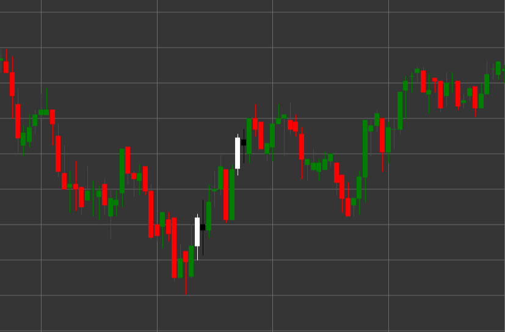

# Pattern Bearish Harami

Bearish Harami is a reversal candlestick pattern consisting of two candles that forms in an uptrend. The term "harami" comes from the Japanese word meaning "pregnancy," as the small candle (child) is contained within the large candle (mother).

##### Key Features:

- First candle is white (bullish) with opening price lower than closing price (O < C) and a long body.
- Second candle is black (bearish) with opening price higher than closing price (O > C) and a smaller body.
- The body of the second candle is completely contained within the body of the first candle (O < pC) and (C > pO).
- Forms in an uptrend.

### Interpretation

Bearish Harami signals a potential end to an uptrend:

- The first candle confirms the existing uptrend and the strength of buyers.
- The second candle, completely contained within the first, indicates a loss of bullish momentum and possible emergence of sellers.
- The smaller the body of the second candle compared to the first, the more pronounced the uncertainty and potential for reversal.
- If the second candle is a doji (with a very small body), the pattern is called a "Harami Cross" and is considered a stronger signal of uncertainty.
- This pattern is often considered a weaker signal compared to Bearish Engulfing, but may be an earlier indicator of a possible reversal.

### Trading Strategies

Bearish Harami typically requires additional confirmation for position entry:

- Wait for a confirming bearish candle after the pattern formation before entering a short position.
- Place a stop-loss above the high of the pattern or the high of the first candle.
- Use trading volume as additional confirmation - decreasing volume on the second candle and increasing on subsequent bearish candles strengthens the signal.
- Combine with other technical indicators, such as RSI in the overbought zone or oscillator divergence.
- Consider the pattern at resistance levels or in overbought zones to increase the probability of a successful trade.
- Possible use for closing existing long positions, even if the signal is not strong enough to open short positions.

## See also

[Pattern Bullish Harami](bullish_harami.md)

[Pattern Bearish Engulfing](bearish_engulfing.md)