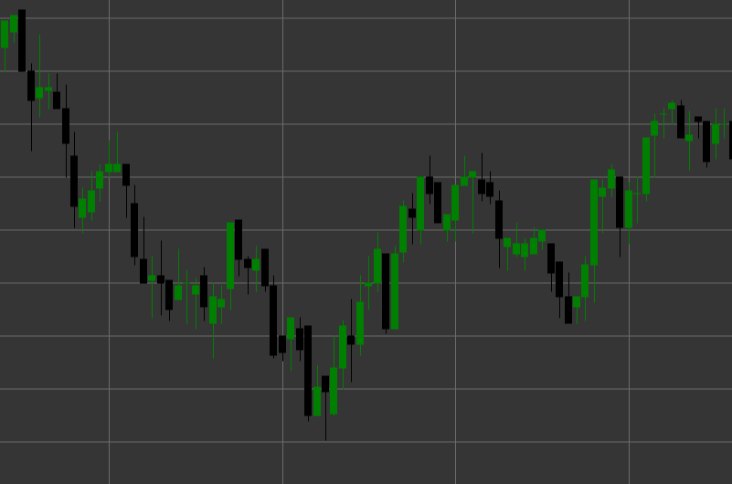

# Pattern Black Candle

Black Candle (bearish candle) is a classic candlestick pattern that forms when the closing price is lower than the opening price. This candle reflects a bearish market sentiment, where sellers controlled the price during the period of candle formation.

##### Key Features:

- Opening price is higher than closing price (O > C).
- The candle body is usually colored black (or red in modern charts).
- Indicates the predominance of sellers over buyers.
- The size of the candle body shows the strength of the bearish movement.

### Interpretation

Black Candle signals bearish pressure in the market:

- The longer the candle body, the stronger the bearish pressure.
- A long black candle after an uptrend may indicate a potential reversal.
- The presence of short shadows indicates that bears controlled the price throughout the period.
- Consecutive black candles indicate a steady downtrend.

### Trading Strategies

Although a single black candle is not usually an independent trading signal, it can be used as part of a broader strategy:

- Confirmation of a downtrend or reversal after an upward movement.
- Looking for long black candles at resistance levels for potential short positions.
- Using in combination with other candlestick patterns, for example, a black candle after a bearish engulfing.
- Identifying support levels after a series of consecutive black candles.

## See also

[Pattern White Candle](white_candle.md)

[Pattern Black Marubozu](black_marubozu.md)