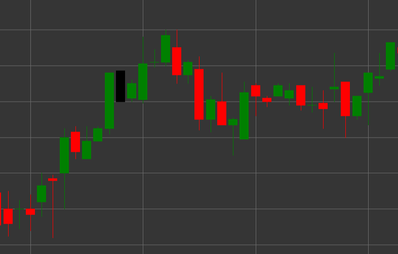

# Pattern Black Marubozu

Black Marubozu is a bearish candlestick pattern characterized by the absence of shadows on both ends of the candle. The term "marubozu" comes from the Japanese word meaning "bald-headed" or "shaved," reflecting the appearance of the candle without shadows.

##### Key Features:

- Opening price is higher than closing price (O > C).
- The candle body is completely filled, without upper and lower shadows.
- Opening price equals the high of the candle, and closing price equals the low of the candle.
- Represents a strong bearish movement, where sellers controlled the price throughout the period.

### Interpretation

Black Marubozu is considered a strong bearish signal:

- The absence of shadows indicates complete seller domination - the price opened at the high and continuously fell until the period closed.
- A long Black Marubozu indicates very strong bearish pressure.
- The appearance of this pattern after an uptrend may signal a reversal.
- Within a downtrend, it confirms the strength of the movement.

### Trading Strategies

Black Marubozu provides a stronger signal than a regular black candle:

- Opportunity to enter a short position after the formation of a Black Marubozu, especially if it appears at an important resistance level.
- Using the closing price of Black Marubozu as a resistance level when setting stop-losses.
- Combining with other technical indicators to confirm the signal.
- Paying attention to trading volume - high volume enhances the significance of the signal.

## See also

[Pattern White Marubozu](white_marubozu.md)

[Pattern Black Candle](black_candle.md)